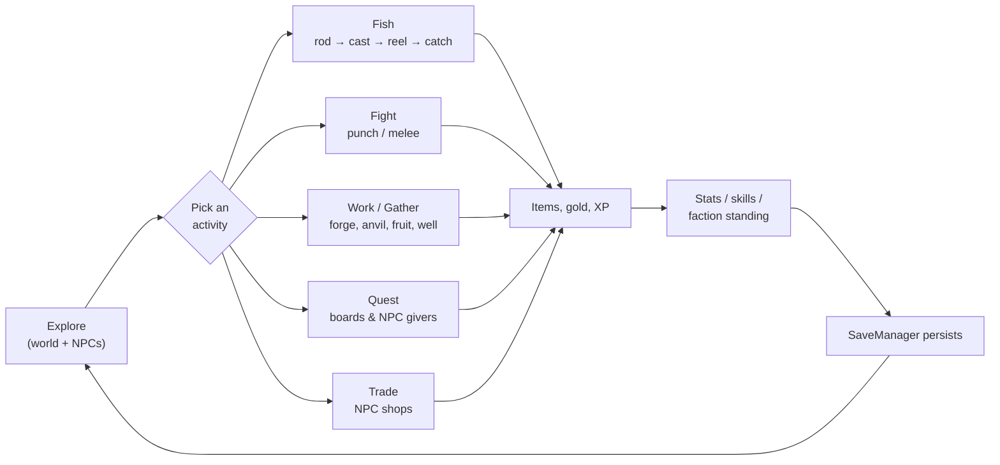

# Fishbox

*A first-person RPG sandbox where you can also fish.*

<!-- TODO: drop a hero screenshot / gif here -->

Fishbox is a first-person sandbox RPG built on a shared actor stack — player and NPCs run on the same souls, the same locomotion, the same action dispatcher. A day might be spent at the forge, hauling water from a well, swinging fists at a bandit on the road, picking up a quest from a board, or — yes — taking a rod down to the water and waiting for something to bite. Stats and skills nudge upward as you use them, factions remember what you did, shops restock on their own clock, and an eclipse occasionally arrives like nothing in particular is happening.

Under the hood it's a Unity 6 project built around a central action/state dispatcher, a physics-grab world where almost anything you can see you can pick up, an Elder Scrolls-style list inventory, registry-authoritative item definitions, an RPG core of ScriptableObject-defined stats/skills/factions/shops, shop-session trading, and a JSON save system that tries hard not to lose your fish *or* your gold. It's a fork of Project-Solr.

## Tech stack

- **Engine:** Unity `6000.3.9f1` (Unity 6)
- **Render pipeline:** URP (custom underwater renderer feature, custom skybox shader)
- **Language:** C# (`net-standard` assembly)
- **3rd-party:** Cinemachine, TextMesh Pro, MicroSplat, Unity Splines, NavMeshAgent

## Getting started

1. Install Unity Hub and Unity Editor `6000.3.9f1` (must match `ProjectSettings/ProjectVersion.txt`).
2. `git clone` this repo.
3. Open the project folder in Unity Hub. First import will build the Library folder — give it a while.
4. Open the main gameplay scene under [Assets/Scenes/](Assets/Scenes/) and hit Play.

If you open the project in an editor version other than `6000.3.9f1`, expect shader compile warnings and silent breakage. Don't.

## Project layout

| Folder | What lives there |
|--------|------------------|
| [ActionSystem/](Assets/Scripts/ActionSystem/) | The central dispatcher. Everything an actor "does" goes through here. → [docs](docs/systems/action-system.md) |
| [RPG/](Assets/Scripts/RPG/) | Stats, skills, factions, shop definitions, and shop runtime sessions. → [docs](docs/systems/rpg.md) |
| [Combat/](Assets/Scripts/Combat/) | Shared melee attack, player punch combat, hit reactions. → [docs](docs/systems/combat.md) |
| [Interactables/](Assets/Scripts/Interactables/) | Interaction points: forges, anvils, wells, fruit trees, beds, containers. → [docs](docs/systems/interactables.md) |
| [Fishing/](Assets/Scripts/Fishing/) | Rod, tackle, bait, cast, reel, caught fish — the headline activity loop. → [docs](docs/systems/fishing.md) |
| [Inventory/](Assets/Scripts/Inventory/) | Inventory, equipment, registry-backed item facade, and direct transfer helpers. → [docs](docs/systems/interactions-inventory.md) |
| [Locomotion/](Assets/Scripts/Locomotion/) | Character movement, IK, footsteps, camera modes. → [docs](docs/systems/locomotion.md) |
| [Management/](Assets/Scripts/Management/) | Managers: save/load, grab, input, water, ripples. → [docs](docs/systems/save-system.md) |
| [NPCs/](Assets/Scripts/NPCs/) | AI characters, states, archetypes, dialogue, trader data. → [docs](docs/systems/npcs.md) |
| [Quests/](Assets/Scripts/Quests/) | Quest definitions, objectives, rewards, lifecycle. → [docs](docs/systems/quests.md) |
| [TimeOfDay/](Assets/Scripts/TimeOfDay/) | Day/night cycle, calendar, celestial bodies, eclipses. → [docs](docs/systems/time-of-day.md) |
| [Water/](Assets/Scripts/Water/) | Water volumes, fish volumes, underwater rendering. → [docs](docs/systems/water.md) |
| [UserInterface/](Assets/Scripts/UserInterface/) | Inventory UI, shop/direct trade UI, item previews, menus, crosshair, HUD. → [docs](docs/systems/ui.md) |
| [Editor/Database/](Assets/Scripts/Editor/Database/) | Authoring window for items, NPCs, quests, RPG definitions. → [docs](docs/systems/database-authoring.md) |
| [Outline/](Assets/Scripts/Outline/), [PhysGrab/](Assets/Scripts/PhysGrab/), [Player/](Assets/Scripts/Player/) | Interaction outline, physics grab, player HUD bars. Covered inline in the docs above. |

## Core gameplay loop

The day is a hub. The player roams the world and chooses an activity; each activity feeds back into the same shared loop of items, gold, XP, and reputation.

Fishing keeps its own seven-beat sub-loop — **equip → cast → wait → bite → reel → catch → persist** — but it now sits alongside combat, work-station interactions, quests, and trading rather than being the whole game. Day/night drives NPC schedules and shop restocks underneath all of it.

## Documentation

System-level docs live under [docs/systems/](docs/systems/):

- [Action System](docs/systems/action-system.md) — the dispatcher all intent flows through
- [Combat](docs/systems/combat.md) — melee attacks, punch combat, hit reactions
- [Database Authoring](docs/systems/database-authoring.md) — editor database menus, authoring buttons, validators
- [Fishing](docs/systems/fishing.md) — rod, tackle, cast/reel state machine
- [Interactables](docs/systems/interactables.md) — interaction points, harvestables, water sources, containers
- [Interactions & Inventory](docs/systems/interactions-inventory.md) — items, equipment, trading, containers
- [Locomotion](docs/systems/locomotion.md) — movement, IK, footsteps
- [NPCs](docs/systems/npcs.md) — AI characters, archetypes, states
- [Quests](docs/systems/quests.md) — quest lifecycle and objectives
- [RPG](docs/systems/rpg.md) — stats, skills, factions, shops
- [Save System](docs/systems/save-system.md) — JSON slots, what persists
- [Time of Day](docs/systems/time-of-day.md) — clock, calendar, sky, eclipses
- [User Interface](docs/systems/ui.md) — menus, inventory UI, trade UI, HUD
- [Water](docs/systems/water.md) — water volumes, fish volumes, underwater rendering

Each doc follows the same shape: a one-line hook, a purpose, the key files, how data flows, where to plug new things in, and the gotchas.

## Contributing

<!-- TODO: fill in branch / PR / commit conventions once the workflow stabilizes -->

In the meantime: new features go behind small, scoped PRs; system docs get updated in the same PR that changes the system. If you touch a file listed in a system doc's **Key files**, re-read the doc and make sure it still tells the truth.

## Credits

Fishbox is a fork of **Project-Solr**. Additional credits: <!-- TODO -->

## License

<!-- TODO -->
