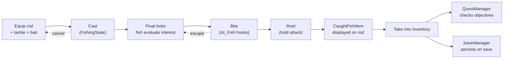

# Fishbox

*A sandbox fishing game where the rod is the main character.*

<!-- TODO: drop a hero screenshot / gif here -->

Fishbox is a first-person sandbox where the loop is small and the world is patient. You wake up, walk to the water, pick a rod off a rack, load a tackle and some bait, and cast. You wait. You reel. You sell what you caught, or eat it, or drop it in a chest and start again. A day passes, the moon rises, NPCs do their thing, and eventually an eclipse happens and everyone acts like it's a Tuesday.

Under the hood it's a Unity 6 project built around a central action/state dispatcher, a physics-grab world where almost anything you can see you can pick up, an Elder Scrolls-style list inventory, and a JSON save system that tries hard not to lose your fish. It's a fork of Project-Solr.

## Tech stack

- **Engine:** Unity `6000.3.9f1` (Unity 6)
- **Render pipeline:** URP (custom underwater renderer feature, custom skybox shader)
- **Language:** C# (`net-standard` assembly)
- **3rd-party:** Cinemachine, TextMesh Pro, MicroSplat, Unity Splines, NavMeshAgent

## Getting started

1. Install Unity Hub and Unity Editor `6000.3.9f1` (must match `ProjectSettings/ProjectVersion.txt`).
2. `git clone` this repo.
3. Open the project folder in Unity Hub. First import will build the Library folder — give it a while.
4. Open the main gameplay scene under [Assets/Scenes/](Assets/Scenes/) and hit Play.

If you open the project in an editor version other than `6000.3.9f1`, expect shader compile warnings and silent breakage. Don't.

## Project layout

| Folder | What lives there |
|--------|------------------|
| [ActionSystem/](Assets/Scripts/ActionSystem/) | The central dispatcher. Everything an actor "does" goes through here. → [docs](docs/systems/action-system.md) |
| [Fishing/](Assets/Scripts/Fishing/) | Rod, tackle, bait, cast, reel, caught fish. → [docs](docs/systems/fishing.md) |
| [Interactions/](Assets/Scripts/Interactions/) | Inventory, equipment, world interactables, trading. → [docs](docs/systems/interactions-inventory.md) |
| [Locomotion/](Assets/Scripts/Locomotion/) | Character movement, IK, footsteps, camera modes. → [docs](docs/systems/locomotion.md) |
| [Management/](Assets/Scripts/Management/) | Managers: save/load, grab, input, water, ripples. → [docs](docs/systems/save-system.md) |
| [NPCs/](Assets/Scripts/NPCs/) | AI characters, states, trader data. → [docs](docs/systems/npcs.md) |
| [Quests/](Assets/Scripts/Quests/) | Quest definitions, objectives, rewards, lifecycle. → [docs](docs/systems/quests.md) |
| [TimeOfDay/](Assets/Scripts/TimeOfDay/) | Day/night cycle, calendar, celestial bodies, eclipses. → [docs](docs/systems/time-of-day.md) |
| [Water/](Assets/Scripts/Water/) | Water volumes, fish volumes, underwater rendering. → [docs](docs/systems/water.md) |
| [UserInterface/](Assets/Scripts/UserInterface/) | Inventory UI, trade UI, menus, crosshair, HUD. → [docs](docs/systems/ui.md) |
| [Outline/](Assets/Scripts/Outline/), [PhysGrab/](Assets/Scripts/PhysGrab/), [Player/](Assets/Scripts/Player/) | Interaction outline, physics grab, player HUD bars. Covered inline in the docs above. |

## Core gameplay loop

The seven beats are: **equip → cast → wait → bite → reel → catch → persist.** Everything else (trading, sleeping, quests, day/night) wraps around that.

## Documentation

System-level docs live under [docs/systems/](docs/systems/):

- [Action System](docs/systems/action-system.md) — the dispatcher all intent flows through
- [Fishing](docs/systems/fishing.md) — the main event
- [Interactions & Inventory](docs/systems/interactions-inventory.md) — items, equipment, trading, containers
- [Locomotion](docs/systems/locomotion.md) — movement, IK, footsteps
- [NPCs](docs/systems/npcs.md) — AI characters and state
- [Quests](docs/systems/quests.md) — quest lifecycle and objectives
- [Time of Day](docs/systems/time-of-day.md) — clock, calendar, sky, eclipses
- [Water](docs/systems/water.md) — water volumes, fish volumes, underwater rendering
- [Save System](docs/systems/save-system.md) — JSON slots, what persists
- [User Interface](docs/systems/ui.md) — menus, inventory UI, trade UI, HUD

Each doc follows the same shape: a one-line hook, a purpose, the key files, how data flows, where to plug new things in, and the gotchas.

## Contributing

<!-- TODO: fill in branch / PR / commit conventions once the workflow stabilizes -->

In the meantime: new features go behind small, scoped PRs; system docs get updated in the same PR that changes the system. If you touch a file listed in a system doc's **Key files**, re-read the doc and make sure it still tells the truth.

## Credits

Fishbox is a fork of **Project-Solr**. Additional credits: <!-- TODO -->

## License

<!-- TODO -->
