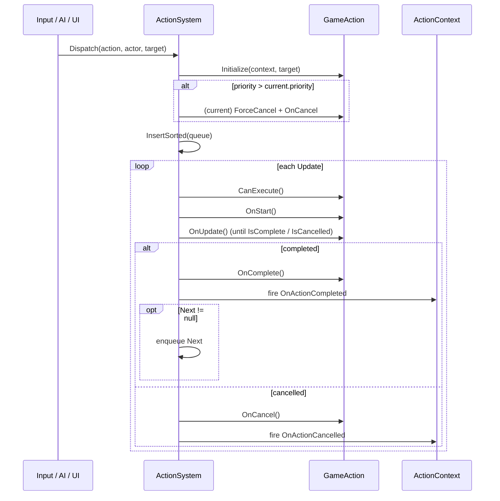

# Action System

*The one pipe everything flows through. If an actor did it, an action ran.*

## Purpose

A single MonoBehaviour singleton that accepts `GameAction` objects, queues them per-actor by priority, and ticks the highest-priority one each frame. Higher-priority actions preempt lower ones. The system also fires start/complete/cancel events and keeps a short history per actor for debugging.

The rule the project enforces, stated plainly: **no system may execute an action outside this pipeline.** Input handlers, AI states, UI — they all build a `GameAction` and call `ActionSystem.Instance.Dispatch(...)`.

## Key files

- [ActionSystem.cs](../../Assets/Scripts/ActionSystem/ActionSystem.cs) — the dispatcher singleton. Per-actor queues, preemption, events, history.
- [GameAction.cs](../../Assets/Scripts/ActionSystem/GameAction.cs) — abstract base. Lifecycle hooks (`CanExecute`, `OnStart`, `OnUpdate`, `OnComplete`, `OnCancel`), `Priority`, optional chained `Next`.
- [ActionContext.cs](../../Assets/Scripts/ActionSystem/ActionContext.cs) — binds an action to its actor (GameObject + cached component lookups).
- [BaseStateSystem.cs](../../Assets/Scripts/ActionSystem/BaseStateSystem.cs) / [IStateSystem.cs](../../Assets/Scripts/ActionSystem/IStateSystem.cs) — state-machine primitives used by actors that need longer-lived state than a single action.
- [Actions/](../../Assets/Scripts/ActionSystem/Actions/) — concrete actions: [CastFishingRodAction](../../Assets/Scripts/ActionSystem/Actions/CastFishingRodAction.cs), [BuyItemAction](../../Assets/Scripts/ActionSystem/Actions/BuyItemAction.cs), [SellItemAction](../../Assets/Scripts/ActionSystem/Actions/SellItemAction.cs), [EquipItemAction](../../Assets/Scripts/ActionSystem/Actions/EquipItemAction.cs), [StartGrabAction](../../Assets/Scripts/ActionSystem/Actions/StartGrabAction.cs) / [StopGrabAction](../../Assets/Scripts/ActionSystem/Actions/StopGrabAction.cs), and the category bases [InteractionAction.cs](../../Assets/Scripts/ActionSystem/InteractionAction.cs) / [ItemAction.cs](../../Assets/Scripts/ActionSystem/ItemAction.cs) / [MovementAction.cs](../../Assets/Scripts/ActionSystem/MovementAction.cs) / [StateAction.cs](../../Assets/Scripts/ActionSystem/StateAction.cs).

## Entry points

- **In-scene:** a single `ActionSystem` component. If one isn't placed in the scene, `[RuntimeInitializeOnLoadMethod]` auto-creates a `[ActionSystem]` GameObject at scene load. (It logs a warning so you know.)
- **Pure classes:** `GameAction` subclasses have no Unity lifecycle — they live or die inside the dispatcher.

## Priority tiers

```
Low = 0    Normal = 10    High = 20    Critical = 30
```

Same-tier actions queue in submission order. Higher-tier actions cancel the current action and jump to the front. Preemption is immediate: the current action's `OnCancel()` runs in the same tick the new one is dispatched.

## Dispatch flow



Notes:
- **Instant chaining**: `OnStart` can call `Complete()` immediately. The dispatcher will dequeue up to `MaxInstantChain = 16` such actions in one tick before logging a warning — that's the safety valve for chains gone infinite.
- **History**: the last `MaxHistoryPerActor = 32` entries per actor are kept and surfaced via `GetDebugSnapshot(actor)`.
- **Exceptions**: a throwing action is force-cancelled; the dispatcher logs and keeps ticking other actors.

## Adding a new action

1. Subclass `GameAction` in `Assets/Scripts/ActionSystem/Actions/` (or a system-local `Actions/` folder if the action is system-specific, e.g. fishing).
2. Override `Priority` if the action must preempt or be preemptable.
3. Implement `CanExecute()` as a side-effect-free precondition check.
4. In `OnStart`, kick off work (animation triggers, state changes). Call `Complete()` right away for instant actions.
5. In `OnUpdate`, tick long-running work and call `Complete()` or `Cancel()` when done.
6. Dispatch it: `ActionSystem.Instance.Dispatch(new YourAction(), actorGameObject, optionalTarget)`.

## Gotchas

- **The action is reusable until you dispatch it.** `Initialize` will throw if you re-init a still-running action. Build a fresh instance per dispatch.
- **Don't touch transforms, physics, animator, or UI from inside an action.** Route through the state/execution components the action's context points at. This is the project's load-bearing constraint — violating it makes preemption and save/load unpredictable.
- **The auto-created singleton is `DontDestroyOnLoad` and reparents itself to root.** If you put an `ActionSystem` under a scene-loaded parent, it still hoists itself out. Don't fight it.
- **`Next` chains fire only on success**, not on cancellation. If you need cleanup-on-cancel chaining, do it in `OnCancel`.
