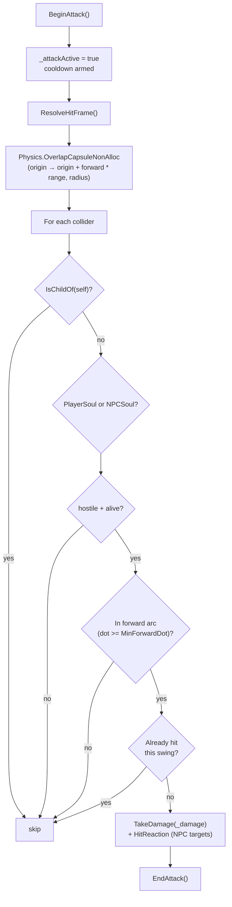

# Combat

*Swing, hit, react. The shared melee implementation player and NPCs both use.*

## Purpose

The combat system is a small, shared melee stack: one attack component that does the actual hit query, one player wrapper that wires input into it, and one hit-reaction component that plays a flinch on the receiving end. Player and hostile NPCs use the same `BasicMeleeAttack` — what differs is who owns the soul on the GameObject.

There is no projectile, ranged, or weapon-modifier system here yet; weapons are inventory items, and damage on this layer is read from serialized fields on the attack component.

## Key files

- [BasicMeleeAttack.cs](../../Assets/Scripts/Combat/BasicMeleeAttack.cs) — the shared attack. Owns damage, range, radius, cooldown, forward-arc dot threshold, hit height offset, target layer mask, and an optional origin transform. Resolves either a `PlayerSoul` or `NPCSoul` on the same GameObject and routes hits accordingly.
- [PlayerPunchCombat.cs](../../Assets/Scripts/Combat/PlayerPunchCombat.cs) — player-side wrapper. `[RequireComponent(typeof(BasicMeleeAttack))]`, holds references to `LocomotionInput`, `LocomotionController`, and `FishingState`, and pushes its serialized punch tuning into the underlying `BasicMeleeAttack` via `ApplyLegacyConfig`.
- [HitReaction.cs](../../Assets/Scripts/Combat/HitReaction.cs) — receiver-side flinch. Plays an `AnimationClip` through a `PlayableGraph` when an animator is available; otherwise runs a coroutine that leans `_fallbackRoot` away from the hit direction and settles back.

## Entry points

- `BasicMeleeAttack` exposes three runtime calls used by animation events or controllers:
  - `BeginAttack()` — starts a swing if `CanStartAttack()` allows it; clears the per-swing hit set and sets the next allowed time from `Cooldown`.
  - `ResolveHitFrame()` — runs the overlap query and applies damage. Drive this from a melee animation event or whenever the active hit window opens.
  - `EndAttack()` — closes the swing.
- `PlayerPunchCombat` is the inspector-friendly setup component on the player. It does not currently consume input directly in `Update`; it keeps a synced config block on `BasicMeleeAttack` so existing player prefabs continue to work while the runtime path is the shared one.
- `HitReaction` is fired from `BasicMeleeAttack.TryDamageTarget` when the target is an `NPCSoul` — call `PlayHitReaction(direction)` directly if you need to trigger a flinch from elsewhere.

## Hit resolution

## Targeting rules

- A swing on the player only damages `NPCSoul` targets that are both alive and have `IsHostile = true`.
- A swing on an NPC only damages a `PlayerSoul` if the attacker NPC is itself hostile.
- Each swing maintains a `HashSet<int>` of damaged target instance ids, so the same overlap query can't double-hit one target across multiple `ResolveHitFrame()` calls in a single swing.
- The forward-arc check uses `_minForwardDot` against `(target.position + up * hitHeightOffset - origin).normalized`. Targets behind the attacker are rejected even if the capsule overlaps them.

## Hit reaction

- If a clip is assigned and the animator is enabled, `HitReaction` builds a one-shot `PlayableGraph` (`AnimationClipPlayable` → `AnimationPlayableOutput`) and tears it down after `_hitClip.length`.
- If there is no clip or no animator, it falls back to a coroutine that rotates `_fallbackRoot` ±`_fallbackLeanDegrees` around local Z based on the sign of the hit direction in local space, then slerps back at `_fallbackSettleSpeed`.
- `OnDisable` and `OnDestroy` both stop the active reaction and dispose the graph if it's still valid.

## Gotchas

- `EngageDistance` (used by AI to decide attack range) is `range + radius`, **not** range alone. A capsule grows by its radius at both ends.
- `_targetLayers` defaults to `~0` (everything). For production setups, narrow it so the capsule doesn't waste work on terrain / props.
- `ApplyLegacyConfig` is called from `PlayerPunchCombat.OnValidate` and `Awake` — editing the punch values on `PlayerPunchCombat` overwrites the underlying `BasicMeleeAttack`'s serialized fields. If you tune the attack component directly, do it on a prefab without `PlayerPunchCombat` or the wrapper will stomp your changes.
- `HitReaction` requires an `Animator` for the clip path — there's no graph-only fallback, only the lean-and-settle fallback.
- Damage is hard-coded into the attack component. There is no item-driven weapon damage hook yet; equipped weapons currently provide visuals and (via items) inventory stats, not runtime swing damage.
- There is no friendly-fire path. A hostile NPC will not damage another hostile NPC through this system.
