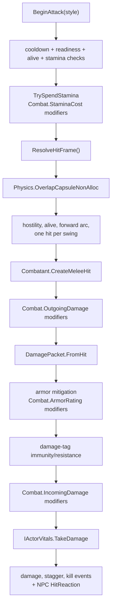

# Combat

*Melee attacks, shared combatants, stamina, armor, damage packets, and hit reactions.*

## Purpose

The combat system is the shared melee runtime for player and NPC actors. `BasicMeleeAttack` owns the hit query and attack timing, while `Combatant` adapts an actor's vitals, equipment, stamina costs, armor, and damage numbers into a common interface. Player and hostile NPCs use the same attack path; what differs is which soul/vitals component and hostility tags are present on the actor.

Runtime math now routes through the RPG stat modifier system. Equipped items, traits, status effects, and custom providers can modify stamina cost, stamina regeneration, armor rating, outgoing damage, and incoming damage.

## Key Files

- [BasicMeleeAttack.cs](../../Assets/Scripts/Combat/BasicMeleeAttack.cs): shared melee attack query, attack profiles, cooldowns, target checks, and hit dispatch.
- [Combatant.cs](../../Assets/Scripts/Combat/Combatant.cs): actor combat facade and cached references.
- [Combatant.References.cs](../../Assets/Scripts/Combat/Combatant.References.cs): resolves player/NPC souls, generic `IActorVitals`, equipment, and target transforms.
- [Combatant.Vitals.cs](../../Assets/Scripts/Combat/Combatant.Vitals.cs): health, stamina, stamina spending, stamina regeneration, and damage forwarding through `IActorVitals`.
- [Combatant.Equipment.cs](../../Assets/Scripts/Combat/Combatant.Equipment.cs): equipped weapon lookup, attack kind, fallback damage, stamina cost, and armor rating.
- [Combatant.MeleeHit.cs](../../Assets/Scripts/Combat/Combatant.MeleeHit.cs): creates `CombatHit` packets and applies outgoing damage modifiers.
- [CombatResolver.cs](../../Assets/Scripts/Combat/CombatResolver.cs): damage application, armor mitigation, damage-tag defenses, incoming damage modifiers, stagger, kill events, and hit reaction triggers.
- [CombatHit.cs](../../Assets/Scripts/Combat/CombatHit.cs): immutable hit data produced by melee attacks.
- [DamagePacket.cs](../../Assets/Scripts/Combat/DamagePacket.cs): mutable damage packet used by melee and status/periodic damage paths.
- [CombatAttackProfile.cs](../../Assets/Scripts/Combat/CombatAttackProfile.cs): light/power attack multipliers for damage, stamina, cooldown, and stagger.
- [PlayerPunchCombat.cs](../../Assets/Scripts/Combat/PlayerPunchCombat.cs): player-side wrapper that keeps legacy punch tuning synced into `BasicMeleeAttack`.
- [HitReaction.cs](../../Assets/Scripts/Combat/HitReaction.cs): receiver-side flinch animation/fallback lean.
- [IActorVitals.cs](../../Assets/Scripts/RPG/IActorVitals.cs): health/stamina contract implemented by `PlayerSoul` and `NPCSoul`.

## Entry Points

- `BasicMeleeAttack.BeginAttack()` / `BeginAttack(style)`: starts a swing if cooldown, readiness, alive state, and stamina checks pass.
- `BasicMeleeAttack.ResolveHitFrame()`: runs the overlap capsule and applies one hit per valid target for the active swing.
- `BasicMeleeAttack.EndAttack()`: clears active swing state.
- `CombatResolver.ApplyHit(hit)`: applies a melee hit.
- `CombatResolver.ApplyDamagePacket(packet)`: applies non-melee damage such as status ticks.
- `Combatant.ResolveOrAdd(...)`: finds or adds the combat facade for an actor or target transform.

## Damage Flow

## Stat Hooks

Combat reads these `GameplayStatIds`:

- `Combat.StaminaCost`: applied before `Combatant.CanSpendStamina` and `TrySpendStamina`.
- `Combat.StaminaRegen`: applied to the actor's per-second stamina regeneration.
- `Combat.ArmorRating`: applied after summing equipped armor item defense.
- `Combat.OutgoingDamage`: applied after weapon/fallback damage and attack-profile damage multipliers.
- `Combat.IncomingDamage`: applied after armor mitigation and damage-tag defenses.
- `Vital.MaxHealth` and `Vital.MaxStamina`: applied by `PlayerSoul` and `NPCSoul`.

`Combatant` consumes `IActorVitals`, so combat can target player souls, NPC souls, or future actor-vitals components without adding another soul-specific branch. `Combatant.ResolveOrAdd(Transform)` searches parent components for a `Combatant`, then player/NPC souls, then any `IActorVitals` component.

## Targeting Rules

- A swing on the player only damages `NPCSoul` targets that are alive and tagged hostile (`Actor.Hostile`).
- A swing on a hostile NPC only damages an alive `PlayerSoul`.
- `NPCSoul.IsHostile` is tag-backed. Legacy hostile fields migrate into `Actor.Hostile`; new combat/law logic should add or remove tags such as `Actor.Hostile`, `Actor.Criminal`, `Actor.Wanted`, `Actor.Dead`, and `Actor.InCombat`.
- Each swing keeps a set of damaged target instance ids so multiple hit frames cannot double-hit the same target in one swing.
- The forward-arc check uses planar direction and allows a close-range bypass radius so very near targets are not rejected for being slightly off-axis.
- `EngageDistance` is `range + radius`; AI should not treat range alone as the usable attack distance.

## Armor And Damage Tags

`Combatant.GetArmorRating` sums equipped armor item defense once per item, then evaluates `Combat.ArmorRating`. `CombatResolver.CalculateArmorMitigation` clamps mitigation at `80%` and uses `armor / (armor + 100)`.

Damage packets carry gameplay tag paths. If the target has `Immune.<leaf>` for a damage tag, final damage becomes zero. If the target has `Resist.<leaf>`, that tagged damage is halved. Melee hits default to `Damage.Physical`.

## Hit Reaction

- `CombatResolver` triggers `HitReaction` only when damage was applied, the target is an alive NPC, and the NPC has a reaction component.
- If a clip is assigned and the animator is enabled, `HitReaction` plays a one-shot `PlayableGraph`.
- If there is no clip or no animator, it falls back to a coroutine that leans `_fallbackRoot` away from the hit direction and settles back.
- `OnDisable` and `OnDestroy` stop the active reaction and dispose the graph if needed.

## Gotchas

- `PlayerPunchCombat.ApplyLegacyConfig` still writes legacy punch tuning into `BasicMeleeAttack`. Tune `BasicMeleeAttack` directly only on prefabs that do not use the wrapper.
- Equipped weapon damage comes from the item registry through `ItemComponent.Damage`; fallback `_damage` is used when no weapon damage is available.
- Equipped armor defense is still summed directly from armor items, then stat modifiers can adjust the resulting `Combat.ArmorRating`.
- `Trait.Tireless` or the matching trait reaction causes combatants to ignore stamina costs after `Combat.StaminaCost` modifiers are evaluated.
- There is no friendly-fire path. A hostile NPC will not damage another hostile NPC through this system.
- Keep target layer masks narrow in production so the overlap capsule does not spend time on terrain and props.
