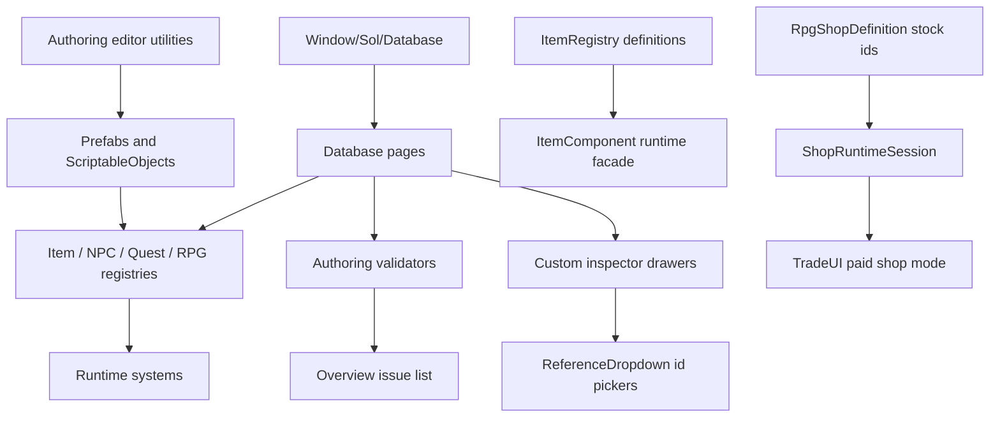

# Database Authoring

*The editor-side control room for ids, registries, prefabs, quests, shops, and the little warning lights that keep them honest.*

## Purpose

The database authoring tools are Unity Editor windows and custom inspectors for creating and maintaining content records. They sit on top of the runtime registries for Items, NPCs, Quests, and RPG definitions, so authors can work from one searchable menu instead of hunting through project folders and raw inspectors.

Open the main tool from `Window/Sol/Database`. The older menu entries for `Window/Sol/Item Database`, `Window/Sol/NPC Database`, and `Window/Sol/Quest Database` now route into the matching tab in the consolidated Sol Database window.

Use this tool for:

- Creating item definitions, optional item visual prefabs, NPC prefabs, quest assets, stats, skills, factions, and shops.
- Duplicating existing records while automatically assigning fresh ids.
- Editing record fields through grouped, author-friendly inspector sections.
- Rebuilding registries after file moves, manual asset edits, or import weirdness.
- Validating cross-references before playtesting.

## Authoritative Data Model

The current item/economy split is intentional:

- `ItemRegistry` is authoritative for item design: names, ids, types, value, icons, flavor text, stack rules, consumable flags, tradeability, use effects, damage, defense, equipment settings, templates, and notes.
- Item prefabs are visual/world representations. They still carry an `ItemComponent` so they can be picked up, equipped, previewed, saved as world instances, and host specialized runtime components, but prefab-authored design fields are legacy compatibility data.
- `ItemComponent` is the runtime facade. Inventory, equipment, tooltips, context menus, fishing, quest checks, save/load, and trade UI can keep asking the component for `ItemName`, `Value`, `Icon`, `Damage`, and similar fields; the component resolves those values from `ItemRegistry`.
- `RpgShopDefinition` owns merchant stock authoring by item id. NPC inventories are still valid for non-shop inventories, corpse loot, containers, quest delivery, and debug/free transfer, but they are not merchant stock.
- `ShopRuntimeSession` owns mutable shop state at runtime: current stock instances, current gold, price calculation, and restock timing. Save/load persists those runtime sessions separately from NPC inventory saves.

## Requirements

- Unity `6000.3.9f1`, matching the project version in [ProjectVersion.txt](../../ProjectSettings/ProjectVersion.txt).
- Main authoring window: `Window/Sol/Database`.
- Registry assets in [Assets/Data/](../../Assets/Data/):
  - [ItemRegistry.asset](../../Assets/Data/ItemRegistry.asset)
  - [NPCRegistry.asset](../../Assets/Data/NPCRegistry.asset)
  - [QuestRegistry.asset](../../Assets/Data/QuestRegistry.asset)
  - [RpgDefinitionRegistry.asset](../../Assets/Data/RpgDefinitionRegistry.asset)
- Default creation folders:
  - Items: `Assets/ItemPrefabs/` (created on demand)
  - NPCs: [Assets/Scripts/NPCs/Prefabs/](../../Assets/Scripts/NPCs/Prefabs/)
  - Quests: [Assets/Data/QuestData/](../../Assets/Data/QuestData/)
  - RPG definitions: `Assets/Data/RPG/` (created on demand)
- Id formats:
  - Items use `ITM#####`.
  - NPC owners use `OWN#####`; the player is pinned as `PLY00001` in NPC reference dropdowns.
  - Quests use `QST#####`.
  - RPG stats, skills, factions, and shops use their RPG prefixes from `RpgDefinitionIds` such as `STA#####`, `SKL#####`, `FAC#####`, and `SHP#####`.

## Main Window

[SolDatabaseWindow.cs](../../Assets/Scripts/Editor/Database/SolDatabaseWindow.cs) owns the top-level editor window. It builds a tab rail for `Overview`, `Stats`, `Skills`, `Factions`, `Items`, `NPCs`, `Shops`, and `Quests`, then delegates each tab to a page object.

Top toolbar buttons:

- `Refresh All`: re-reads every tab from its registry and clears cached warning state.
- `Validate All`: gathers issues from every non-overview tab, shows a summary dialog, then switches to `Overview`.

Tab rail buttons:

- `Overview`: health summary and issue list.
- `Stats`, `Skills`, `Factions`, `Shops`: RPG `ScriptableObject` definition authoring.
- `Items`, `NPCs`, `Quests`: prefab and quest authoring pages.

Rows in the left panes are virtualized, so large registries stay responsive. Click a row to select it. The `! n` badge means the selected record has `n` warnings or errors from its validator.

## Overview Tab

[SolDatabaseOverviewPage.cs](../../Assets/Scripts/Editor/Database/SolDatabaseOverviewPage.cs) is the health dashboard. It counts errors, warnings, info messages, and total issues across the other tabs.

Buttons:

- `Refresh Issues`: rebuilds the issue list from all database pages.
- `Open`: jumps to the affected tab and selects the record when the issue has an id. If the issue has a Unity object context, the window pings it in the Project view.

Use this tab as the last stop before playtesting a content batch.

## Items Tab

[SolDatabaseItemPage.cs](../../Assets/Scripts/Editor/Database/SolDatabaseItemPage.cs) reads from `ItemRegistry` and edits selected registry definitions. The item row is the logical item definition, not the prefab. Prefab/world editing lives in a separate `Visual / World Prefab` section so designers can tune pickup visuals without changing gameplay design.

Toolbar buttons:

- `New`: creates a registry entry first, assigns the next `ITM#####`, applies the selected template, and can create or assign a visual/world prefab for pickup and preview rendering.
- Template popup: controls which `ItemAuthoringTemplate` `New` uses. Options include `None`, `Consumable`, `KeyItem`, `Equipment`, `FishingBait`, `FishingLure`, and `Currency`.
- `Duplicate`: duplicates the selected registry definition, assigns a fresh item id, and either reuses or duplicates the visual prefab depending on the workflow.
- `Reveal Prefab`: opens the selected prefab's folder in the operating system file browser.
- `Select`: selects and pings the selected prefab in Unity.
- `Rebuild Registry`: forces `ItemRegistry` editor sync, then refreshes the tab.

Left pane controls:

- Search field: searches registry display name, id, type display name, and visual prefab path.
- Filter popup: `All`, `Consumable`, `Equipable`, `Stackable`, `MissingIcon`, or `HasWarnings`.
- `Type` toggle and type popup: when enabled, restricts the list to one `ItemType`.
- `Sort`: sorts by `Name`, `Id`, or descending `Value`.

Detail buttons:

- `Fill Missing Defaults`: non-destructive template repair. It fills blank ids, placeholder names, missing canonical components, and only default-ish template fields.
- `Reapply...`: destructive template repair. It opens a confirmation dialog and overwrites authored fields listed in the preview. Prefer `Fill Missing Defaults` unless you intentionally want template values restored.
- `Add Fishing Bait Component`: appears in the item inspector's `Fishing` section when a bait-style item lacks `FishingBaitItem`.
- `Add Fishing Lure Component`: appears in the item inspector's `Fishing` section when a lure-style item lacks `FishingLureItem`.
- `Reveal Section`: appears when hidden equipment data exists on a non-equipment item, allowing cleanup of stale equipment fields.

Inspector sections:

- `Definition`: locked item id, display name, type, value, icon, and flavor text. These are registry-authored gameplay values.
- `Inventory Rules`: stackability, max stack size, consumable flag, and tradeability.
- `Use`: use occasion and use effects when the item can be used.
- `Equipment`: damage, defense, equip socket, offsets, equip domain, handing, and allowed slots.
- `Visual / World Prefab`: prefab reference, pickup grip, mesh, and materials. This is visual/world setup only.
- `Authoring`: template marker and notes.

Migration and compatibility:

- `Tools/Sol/Items/Migrate Prefab Design Into Registry` copies legacy prefab-authored design fields into matching `ItemRegistry.Entry` records and marks each prefab as migrated.
- Registry sync still discovers item prefabs and assigns/fixes `ITM#####` ids, but it does not overwrite existing registry design fields after migration.
- Validators warn when legacy prefab design fields drift from the registry definition. Treat the registry value as the gameplay truth.

## NPCs Tab

[SolDatabaseNPCPage.cs](../../Assets/Scripts/Editor/Database/SolDatabaseNPCPage.cs) reads from `NPCRegistry`, shows NPC prefabs, and edits the selected `NPCSoul` with [NPCAuthoringDrawerUtility.cs](../../Assets/Scripts/NPCs/Editor/NPCAuthoringDrawerUtility.cs).

Toolbar buttons:

- `New`: creates a prefab in `Assets/Scripts/NPCs/Prefabs`, adds `NPCSoul`, `AI_NPC`, and `Inventory`, assigns the next `OWN#####`, applies the selected archetype, rebuilds the registry, selects the prefab, and pings it.
- Archetype popup: controls the new NPC archetype. Options are `None`, `Civilian`, `Guard`, `Bandit`, `Quest Giver`, and `Unique`.
- `Duplicate`: copies the selected prefab, assigns a fresh owner id, renames it as a copy, rebuilds the registry, selects it, and pings it.
- `Reveal Prefab`: opens the selected prefab's folder.
- `Select`: selects and pings the selected prefab in Unity.
- `Rebuild Registry`: forces `NPCRegistry` editor sync, then refreshes the tab.

Left pane controls:

- Search field: searches character name, owner id, entity type, archetype, and prefab path.
- Filter popup: `All`, `Trader`, `QuestGiver`, `Guard`, `Bandit`, `Hostile`, `MissingAIConfig`, or `HasWarnings`.
- `Sort`: sorts by `Name`, `OwnerId`, or `EntityType`.

Detail buttons:

- `Fill Missing Defaults`: non-destructively fills missing owner id, archetype marker, identity migration flag, and canonical components.
- `Reapply...`: opens a confirmation dialog and reapplies archetype defaults. Bandits become hostile; all archetypes get the expected AI/inventory setup.
- `Regenerate OwnerId`: assigns the next available `OWN#####` to the selected NPC and schedules registry sync.
- `Add AI_NPC Component`: appears when the prefab is missing AI support.
- `Add Inventory Component`: appears when the prefab is missing inventory support.
- `Reveal in Project`: pings the selected prefab or component.
- `Spawn in Scene`: instantiates the prefab at the active Scene view pivot and registers Undo.

Inspector sections:

- `Identity`: character name, entity type, locked owner id, vitals, archetype, trader flag, hostile flag, notes.
- `AI & Movement`: AI config, patrol root, patrol points, navmesh snap distance, spline override.
- `Inventory`: capacity, gold, and seed contents with item dropdowns and quantities.
- `Dialogue & Trading`: conversation prompt labels, greeting, speaker icon, trade labels, legacy trader warning.
- `Conversation`: dialogue graph editor.
- `Death & Loot`: death animation settings and corpse loot itemization.
- `References`: AI and inventory object references, owner id dropdown, required key item dropdown.
- `Debug`: reveal and spawn helpers.

## Quests Tab

[SolDatabaseQuestPage.cs](../../Assets/Scripts/Editor/Database/SolDatabaseQuestPage.cs) reads from `QuestRegistry`, shows quest assets, edits selected `QuestDefinition` assets with [QuestAuthoringDrawerUtility.cs](../../Assets/Scripts/Quests/Editor/QuestAuthoringDrawerUtility.cs), and can show a flow panel.

Toolbar buttons:

- `New`: creates a quest asset in `Assets/Data/QuestData`, assigns the next `QST#####`, applies the selected template, seeds a first objective when appropriate, rebuilds the registry, selects the asset, and pings it.
- Template popup: controls the quest template. Options include `None`, `FishCatch`, `Delivery`, `TalkTo`, and `Collect`.
- `Duplicate`: copies the selected quest asset, assigns a fresh quest id, renames it as a copy, rebuilds the registry, selects it, and pings it.
- `Reveal Asset`: opens the selected asset's folder.
- `Select`: selects and pings the selected quest asset.
- `Rebuild Registry`: forces `QuestRegistry` editor sync, then refreshes the tab.
- `Flow`: toggles the right-side flow panel.

Left pane controls:

- Search field: searches title, quest id, giver display, objective summary text, and asset path.
- Filter popup: `All`, `AutoOffer`, `Repeatable`, `Timed`, `Untimed`, `MissingGiver`, `HasWarnings`, or `OrphanedPrereqs`.
- `Sort`: sorts by `QuestId`, `Title`, or `GiverName`.

Detail buttons:

- `Reapply...`: opens a confirmation dialog and reapplies the quest template marker. Template objectives are only seeded if the objective list is empty.
- `Regenerate QuestId`: assigns the next available `QST#####` and schedules registry sync.
- `Open in NPC Database`: appears in `Giver` when a giver id is present; jumps to the NPC tab and selects that owner id.
- `->` buttons in prerequisite and reward lists: jump to the referenced quest or item.
- Reorderable list buttons `+` and `-`: add or remove prerequisites, objectives, and reward items.

Flow panel buttons:

- Prerequisite/downstream quest buttons: jump to that quest in the Quests tab.
- Objective timeline buttons: focus the clicked objective in the objective list.

Inspector sections:

- `Identity`: title, locked quest id, summary, auto-offer, repeatability, repeat timing, time limit, retry delay.
- `Giver`: NPC owner id for NPC-offered or turn-in quests; empty means board-only.
- `Prerequisites`: ordered quest id references and cycle warning.
- `Objectives`: sequential objective list rendered by [QuestObjectiveDrawer.cs](../../Assets/Scripts/Quests/Editor/QuestObjectiveDrawer.cs).
- `Reward`: gold and item rewards.
- `Authoring`: template marker and notes.

## RPG Definition Tabs

[SolDatabaseRpgDefinitionPage.cs](../../Assets/Scripts/Editor/Database/SolDatabaseRpgDefinitionPage.cs) is the shared implementation for `Stats`, `Skills`, `Factions`, and `Shops`. [SolDatabaseRpgPages.cs](../../Assets/Scripts/Editor/Database/SolDatabaseRpgPages.cs) supplies the per-tab labels, prefixes, registry lists, and row subtitles.

Shared toolbar buttons:

- `New`: creates a `ScriptableObject` in `Assets/Data/RPG`, assigns the next id for that definition type, rebuilds the RPG registry, selects the asset, and pings it.
- `Duplicate`: copies the selected definition asset beside the source, assigns a fresh id, renames it as a copy, rebuilds the registry, selects it, and pings it.
- `Reveal Asset`: opens the selected asset's folder.
- `Select`: selects and pings the selected asset in Unity.
- `Rebuild Registry`: forces `RpgDefinitionRegistry` editor sync.

Left pane controls:

- Search field: searches display name, id, row subtitle, and asset path.
- Filter popup: `All`, `MissingId`, or `HasWarnings`.
- `Sort`: sorts by `Name` or `Id`.

Tab-specific behavior:

- `Stats`: uses `RpgStatDefinition`, `STA#####`, and shows category, base value, min, and max. This tab also reports registry-wide RPG issues so duplicate ids are caught once.
- `Skills`: uses `RpgSkillDefinition`, `SKL#####`, and shows category, max level, and governing stat id.
- `Factions`: uses `RpgFactionDefinition`, `FAC#####`, and shows joinable/legal-authority flags plus relationship count.
- `Shops`: uses `RpgShopDefinition`, `SHP#####`, and shows owner id, gold, stock count, buy/sell multipliers, and restock settings. Stock rows reference item ids from `ItemRegistry`.

## Script Responsibilities

Core database window:

- [SolDatabaseWindow.cs](../../Assets/Scripts/Editor/Database/SolDatabaseWindow.cs): top-level window, tab routing, global refresh/validation, issue navigation.
- [SolDatabaseOverviewPage.cs](../../Assets/Scripts/Editor/Database/SolDatabaseOverviewPage.cs): health summary and clickable issue rows.
- [SolDatabaseItemPage.cs](../../Assets/Scripts/Editor/Database/SolDatabaseItemPage.cs): item page list, filters, selection, item toolbar actions, and item issue collection.
- [SolDatabaseNPCPage.cs](../../Assets/Scripts/Editor/Database/SolDatabaseNPCPage.cs): NPC page list, filters, selection, NPC toolbar actions, inventory seed issue checks, and NPC issue collection.
- [SolDatabaseQuestPage.cs](../../Assets/Scripts/Editor/Database/SolDatabaseQuestPage.cs): quest page list, filters, selection, quest toolbar actions, prerequisite/objective flow panel, and quest issue collection.
- [SolDatabaseRpgDefinitionPage.cs](../../Assets/Scripts/Editor/Database/SolDatabaseRpgDefinitionPage.cs): generic list/detail implementation for RPG definition assets.
- [SolDatabaseRpgPages.cs](../../Assets/Scripts/Editor/Database/SolDatabaseRpgPages.cs): concrete Stats, Skills, Factions, and Shops pages.
- [RpgDefinitionEditorUtility.cs](../../Assets/Scripts/Editor/Database/RpgDefinitionEditorUtility.cs): creates/duplicates RPG definition assets, assigns ids, ensures `Assets/Data/RPG`.
- [RpgDefinitionValidator.cs](../../Assets/Scripts/Editor/Database/RpgDefinitionValidator.cs): validates RPG ids, duplicates, skill/stat references, faction relationships, shop owners, stock, and price multipliers.

Shared editor helpers:

- [ReferenceDropdown.cs](../../Assets/Scripts/Editor/Common/ReferenceDropdown.cs): searchable dropdowns for item, NPC, quest, and shop ids. It also warns when an id is missing from the relevant registry and repaints open database windows after selections.

Item authoring:

- [ItemDatabaseWindow.cs](../../Assets/Scripts/Inventory/Editor/ItemDatabaseWindow.cs): legacy item window entry point; routes to the Items tab.
- [ItemAuthoringEditorUtility.cs](../../Assets/Scripts/Inventory/Editor/ItemAuthoringEditorUtility.cs): creates/duplicates item prefabs, assigns `ITM#####`, applies templates, adds canonical components, fills missing defaults.
- [ItemAuthoringValidator.cs](../../Assets/Scripts/Inventory/Editor/ItemAuthoringValidator.cs): validates registry item definitions, legacy prefab drift, item ids, placeholder names, icons, visual prefab references, stack rules, gold rules, use effects, equipment slots, bait/lure components, and registry duplicates.
- [ItemComponentEditor.cs](../../Assets/Scripts/Inventory/Editor/ItemComponentEditor.cs): custom inspector entry point for `ItemComponent`.
- [ItemComponentEditorUtility.cs](../../Assets/Scripts/Inventory/Editor/ItemComponentEditorUtility.cs): grouped item inspector UI and item-specific buttons.
- [ItemUseEffectDrawer.cs](../../Assets/Scripts/Inventory/Editor/ItemUseEffectDrawer.cs): custom property UI for item use effects.

NPC authoring:

- [NPCDatabaseWindow.cs](../../Assets/Scripts/NPCs/Editor/NPCDatabaseWindow.cs): legacy NPC window entry point; routes to the NPCs tab.
- [NPCAuthoringEditorUtility.cs](../../Assets/Scripts/NPCs/Editor/NPCAuthoringEditorUtility.cs): creates/duplicates NPC prefabs, assigns `OWN#####`, applies archetypes, adds canonical AI/inventory components.
- [NPCAuthoringValidator.cs](../../Assets/Scripts/NPCs/Editor/NPCAuthoringValidator.cs): validates owner ids, AI setup, inventory setup, dialogue graph references, quest references, trader flags, vitals, and registry duplicates.
- [NPCAuthoringDrawerUtility.cs](../../Assets/Scripts/NPCs/Editor/NPCAuthoringDrawerUtility.cs): grouped NPC inspector UI, seed inventory list, dialogue/trade/death/debug controls.
- [DialogueGraphDrawer.cs](../../Assets/Scripts/NPCs/Editor/DialogueGraphDrawer.cs): embedded dialogue graph editor used by NPC authoring.
- [AI_NPC_TraderMigration.cs](../../Assets/Scripts/NPCs/Editor/AI_NPC_TraderMigration.cs): one-shot and menu-driven migration from legacy `NpcTrader` fields to `AI_NPC`.

Quest authoring:

- [QuestDatabaseWindow.cs](../../Assets/Scripts/Quests/Editor/QuestDatabaseWindow.cs): legacy quest window entry point; routes to the Quests tab.
- [QuestAuthoringEditorUtility.cs](../../Assets/Scripts/Quests/Editor/QuestAuthoringEditorUtility.cs): creates/duplicates quest assets, assigns `QST#####`, applies quest templates, seeds first objectives.
- [QuestAuthoringValidator.cs](../../Assets/Scripts/Quests/Editor/QuestAuthoringValidator.cs): validates quest ids, giver ids, prerequisites, prerequisite cycles, objectives, item/NPC references, rewards, repeat timing, and registry duplicates.
- [QuestAuthoringDrawerUtility.cs](../../Assets/Scripts/Quests/Editor/QuestAuthoringDrawerUtility.cs): grouped quest inspector UI, prerequisite/objective/reward lists, focus helpers, and cross-database jump buttons.
- [QuestObjectiveDrawer.cs](../../Assets/Scripts/Quests/Editor/QuestObjectiveDrawer.cs): per-objective field rendering based on objective type.

## Data Flow

Registries are the source of the visible database lists. Creation utilities save assets, force registry sync, and then the pages refresh from the registry. Manual asset edits can lag until a registry sync, which is why every major tab has a `Rebuild Registry` button.

For items, the registry is also the source of runtime design data. Prefabs remain linked from entries so world pickup, equipped visuals, specialized components, and inventory/trade previews can still instantiate a real visual object.

## Validation Notes

Errors are issues that usually block correct runtime lookup: missing registries, missing ids, duplicate ids, malformed ids, missing quest objectives, missing quest givers, and null registry entries.

Warnings point at likely authoring mistakes: placeholder names, missing icons, missing visual prefabs, prefab design drift, missing AI config, missing inventory, bad item references, invalid equipment slots, orphaned prerequisites, bad shop stock, and suspicious stack or price values.

Info messages are contextual: board-only quests, ignored repeat timing, hidden use actions, runtime catch prefabs, and similar cases where the data may be intentional.

## Authoring Workflow

1. Open `Window/Sol/Database`.
2. Pick the tab for the content type.
3. Click `New` with the appropriate template or archetype.
4. Fill required fields in the right inspector.
5. Use dropdowns for item, NPC, and quest ids wherever possible.
6. Click `Rebuild Registry` if the list does not reflect your new asset or manual file changes.
7. Open `Overview`, click `Refresh Issues`, and resolve errors first.
8. Playtest the content path that consumes the authored data.

For shop content, author the stock in the `Shops` tab with item ids. Assign the shop id to the trader NPC in the NPC tab. Do not seed merchant stock through the NPC inventory unless the inventory is meant for non-shop behavior such as loot, quest delivery, or free/debug transfer.

## Notes

- The consolidated window is the preferred authoring surface. The older item/NPC/quest database menu entries exist for muscle memory and deep links.
- `Fill Missing Defaults` is the safe repair button. `Reapply...` intentionally overwrites fields listed in its confirmation dialog.
- Id fields are usually locked in the custom inspectors because ids are registry keys. Use regenerate buttons only when creating a new logical record or fixing a duplicate.
- Quest objectives are sequential at runtime; list order matters.
- Empty quest giver means board-only quest. For NPC-offered or NPC-turn-in quests, use an NPC owner id.
- Reference dropdowns write string ids, not object references. If a dropdown shows `<Missing>`, the string exists but the registry cannot currently resolve it.
- Shops validate against both NPC and item registries, so registry sync order matters after big content moves.
- Merchant stock comes from `RpgShopDefinition`, not NPC inventory seed contents.
- Item values, icons, names, stack rules, use effects, and equipment stats come from `ItemRegistry`, not prefab legacy fields.
- Runtime caught-fish item prefabs intentionally skip normal item checks because their name, value, icon, and visual are populated by runtime fish data.
- The NPC trader migration can be run manually from `Tools/Sol/NPCs/Migrate NpcTrader -> AI_NPC` if old prefabs still carry `NpcTrader`.
