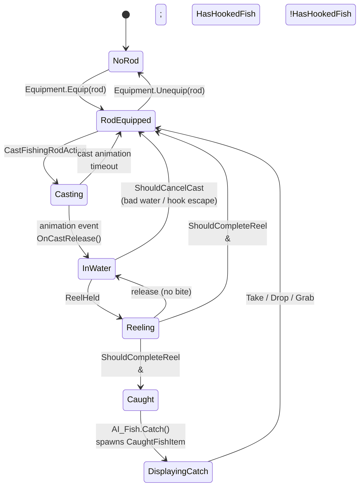

# Fishing

*Everything between "I have a rod" and "I have a fish."*

## Purpose

Fishing is one of the project's headline activity loops, sitting alongside combat, work stations, quests, and trading. A player equips a rod, optionally loads a lure and bait, casts into a water volume, waits for a bite, reels, and either lands a catch or watches the fish escape. The system is state-driven (not coroutine-driven), animation-aware, and tag-aware: rods, lures, bait, caught fish, rarity, and predator behavior can all be queried through gameplay tags.

## Key files

- [FishingState.cs](../../Assets/Scripts/Fishing/FishingState.cs) — the main MonoBehaviour driving the whole loop. Holds the cast/reel state, spawns the tackle instance, talks to the animator, wires the line renderer.
- [FishingRodItem.cs](../../Assets/Scripts/Fishing/FishingRodItem.cs) — inspector-authored rod data: cast distance, arc, reel speed, line material, default bait, attach points.
- [FishingLureItem.cs](../../Assets/Scripts/Fishing/FishingLureItem.cs) / [FishingLureInstance.cs](../../Assets/Scripts/Fishing/FishingLureInstance.cs) — the loaded lure item (inventory-side) and the spawned in-world lure (flight arc, float bob, fish interest radius, hook state).
- [FishingBaitDefinition.cs](../../Assets/Scripts/Fishing/FishingBaitDefinition.cs) / [FishingBaitItem.cs](../../Assets/Scripts/Fishing/FishingBaitItem.cs) — authored bait and the component that applies interest + radius multipliers at cast time.
- [FishingRodBootstrap.cs](../../Assets/Scripts/Fishing/FishingRodBootstrap.cs) — bootstrap helper for rigging the rod at scene start.
- [Assets/Scripts/AI_Fish.cs](../../Assets/Scripts/AI_Fish.cs) — the fish AI. Evaluates tackle interest, hooks the line, and on reel-complete calls `Catch(...)` which returns a spawned [CaughtFishItem.cs](../../Assets/Scripts/Interactions/CaughtFishItem.cs).
- [Water/FishVolume.cs](../../Assets/Scripts/Water/FishVolume.cs) — the spawn box. Defines what species live where and how many.

## Entry points

- `FishingState` sits on the player GameObject, next to `Equipment`, `LocomotionInput`, and `LocomotionController`. It listens to `Equipment.OnChanged` and auto-resolves the equipped rod.
- Player attack input (`LocomotionInput.AttackPressed`) is consumed in `Update` — when a rod is equipped, that press dispatches a `CastFishingRodAction`.
- The reel is a separate input (`LocomotionInput.ReelHeld`) held while the tackle is in the water.

## Fishing state machine

The three "soft" transitions worth knowing:
- **Cast timeout** (`_castAnimationTimeout`, default 2s): if the cast animation event never fires the release, the cast is aborted cleanly.
- **Hook escape window** (`_fallbackHookEscapeWindow`): if you release reel after the fish is hooked, you get this long to re-grab it before it bolts.
- **ShouldCancelCast**: raised by `FishingLureInstance` when the lure lands somewhere invalid (not in a `WaterVolume`) or misses its water-contact timeout.

## Cast → reel data flow

1. **Equip.** `FishingState.ResolveEquippedRod` picks the first equipped item tagged `Item.Fishing.Rod` (or carrying `FishingRodItem`, or matching the fallback name). Caches line origin and resting lure visual.
2. **Load lure + bait.** `TryLoadLure` / `TryLoadBait` move items from inventory onto the rod. Lures match `Item.Fishing.Lure`; bait matches `Item.Fishing.Bait` or compatible food tags. Inventory-full aborts restore the old item.
3. **Cast.** `BeginCast` raycasts from the camera centre, finds a cast target point and the `WaterVolume` under it, triggers the cast animation, and locks movement briefly.
4. **Release.** An animation event calls `OnCastRelease`, which spawns a `FishingLureInstance` (from the rod's configured prefab or cloning the resting lure visual as a fallback) and launches it along an arc.
5. **Float.** Without reel input, the lure bobs on the water surface (`SetFloatAnchor`) with configurable drift and tension. `AI_Fish` instances within the interest radius evaluate bait id, bait tags, then legacy bait name and may hook the line.
6. **Reel.** Holding the reel input engages `BeginReel`; distance-to-rod-tip drives `_reelProgress`, which drives the animator.
7. **Complete.** When tackle reaches the rod tip (or progress ≥ 0.99), `CompleteReel` runs. If a fish is hooked, `AI_Fish.Catch` spawns a [CaughtFishItem](../../Assets/Scripts/Interactions/CaughtFishItem.cs) and attaches it to the rod as a displayed catch.
8. **Hand-off.** `TryTakeDisplayedCatch` moves it into inventory, `TryGrabDisplayedCatch` hands it to the physics-grab system, `TryDropDisplayedCatch` frees it to the world.

## Adding a new fish

1. Author a `FishDefinition` asset (see [Fishing/Editor/FishDefinitionAssetGenerator.cs](../../Assets/Scripts/Fishing/Editor/FishDefinitionAssetGenerator.cs) for the generator).
2. Add a prefab with `AI_Fish` pointing at that definition.
3. Drop the prefab into a `FishVolume`'s `fishSpawnEntries` with a spawn chance.
4. Done — no script changes required. The tackle's interest radius plus the bait's multipliers handle which fish get drawn.

## Adding a new bait

1. Create a `FishingBaitDefinition` ScriptableObject with interest and radius multipliers.
2. Author a pickup prefab with `FishingBaitItem` referencing it and an `ItemComponent` (so it lives in inventory).
3. Add `Item.Fishing.Bait` or a compatible food tag to the item definition.
4. The rod will accept it via `TryLoadBait` when a lure is already loaded.

## Tags

- Rod identity: `Item.Fishing.Rod`.
- Lure identity: `Item.Fishing.Lure`.
- Bait identity: `Item.Fishing.Bait`; `Item.Food` remains supported as a general bait fallback.
- Caught fish item identity: `Item.Fishing.Caught`.
- Fish matching: `Fish.Predator`, `Fish.Rarity.Common`, `Fish.Rarity.Uncommon`, `Fish.Rarity.Rare`, `Fish.Rarity.Legendary`, `Fish.Rarity.Mythical`, plus any authored species/family tags.

Caught fish inherit definition tags, get runtime rarity/predator tags, and save their tag paths through `CaughtFishData`. Quests, UI filters, and special handling should query tags instead of string names.

## Gotchas

- **The fallback path is real and load-bearing.** Most tunables on `FishingState` are mirrored twice — the `_activeRod` value and a `_fallback*` value. If you add a new rod-driven tunable, add both sides or the rod-less fallback path silently uses zero.
- **`ItemComponent` on the spawned lure is destroyed.** `SpawnLureInstance` strips it so the in-world lure isn't treated as a pickup. If you build a custom lure prefab, don't rely on its `ItemComponent` existing after cast.
- **The displayed catch is a world object parented to the rod.** It has physics disabled while displayed. If you grab it via `StartGrabAction` mid-display, the fishing state releases it cleanly — don't try to shortcut by re-parenting directly.
- **Cast targets are chosen by camera raycast, not rod forward.** A player looking straight up casts straight up. This is intentional (feels responsive) but surprising if you're debugging from the rod's perspective.
