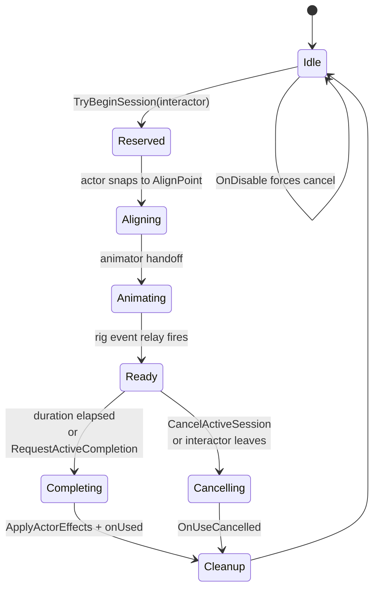
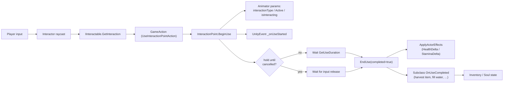

# Interactables

*Forges, anvils, fruit trees, wells, beds, chests, quest boards. Anything the player walks up to and presses Use on.*

## Purpose

The interactables layer is the contract between the player's `Interactor` and the world objects it can act on. Every world object that wants a "press E to..." prompt implements [IInteractable](../../Assets/Scripts/Interactables/I_Interactable.cs); the [Interactor](../../Assets/Scripts/Interactables/Interactor.cs) wraps the actor (player or NPC) doing the interacting and exposes its `Inventory`, `PlayerSoul`, and `NPCSoul`.

The bulk of the new "do a thing in the world" surface ports the Solr **InteractionPoint** family: a single component that handles an aligned, animated, time-boxed use with optional actor effects (heal, restore stamina). Specialized subclasses add per-type behaviour like harvesting an item or filling a water container. Runtime categories and affordances are tag-first, so a point can become a shop counter, bed, workstation, harvestable, fishing spot, or private object through tags rather than a dedicated bool.

## Key files

Contract & dispatch:

- [I_Interactable.cs](../../Assets/Scripts/Interactables/I_Interactable.cs) — the `IInteractable` interface (`InteractionPrompt`, `CanInteract`, `GetInteraction`). Also home to shared utility (`SoulStat`, `EntityCodeUtility`, dropdown attributes).
- [Interactor.cs](../../Assets/Scripts/Interactables/Interactor.cs) — wraps an interacting actor with cached `Inventory`, `NPCSoul`, `PlayerSoul`, and `IsPlayer` flag.
- [ItemActionSystem.cs](../../Assets/Scripts/Interactables/ItemActionSystem.cs) / [ItemActionType.cs](../../Assets/Scripts/Interactables/ItemActionType.cs) — inventory-side action dispatch (`Use`, `Equip`, `Drop`).

Interaction points (Solr port — `InteractionPoint` is now split across partial files):

- [InteractionPoint.cs](../../Assets/Scripts/Interactables/InteractionPoint.cs) — the root. Owns id (`INP#####`), prompt, display name, legacy type, gameplay tags, shop id, ownership, animation type, use duration, hold-until-cancelled flag, single-occupancy flag, tag-gated actor/item rules, allow-player/allow-NPC flags, and four actor-effect deltas (health/stamina/hunger/thirst). Holds the current `InteractionSession`.
- [InteractionPoint.Alignment.cs](../../Assets/Scripts/Interactables/InteractionPoint.Alignment.cs) — multiple align points, NPC arrival tolerance, and aligning-state handoff.
- [InteractionPoint.Animator.cs](../../Assets/Scripts/Interactables/InteractionPoint.Animator.cs) — drives the actor animator (`interactionType` int, `interactionActive` bool, `isInteracting` trigger) and listens for the rig's ready/cleanup events via `InteractionAnimationEventRelay`.
- [InteractionPoint.PlayerLock.cs](../../Assets/Scripts/Interactables/InteractionPoint.PlayerLock.cs) — locks locomotion / camera while the player is mid-use.
- [InteractionPoint.Reservation.cs](../../Assets/Scripts/Interactables/InteractionPoint.Reservation.cs) — duration-based reservation system used by NPC schedule states (`TryReserve`, `ReleaseReservation`, `IsReservedBy`).
- [InteractionSession.cs](../../Assets/Scripts/Interactables/InteractionSession.cs) — per-use state machine: `Reserved → Aligning → Animating → Ready → Completing/Cancelling → Cleanup`.
- [InteractionDefinition.cs](../../Assets/Scripts/Interactables/InteractionDefinition.cs) — optional `ScriptableObject` that supplies default display name, type, animation type, and effects so multiple points can share authoring.
- [InteractionEffect.cs](../../Assets/Scripts/Interactables/InteractionEffect.cs) — per-event hooks fired by the session (start, ready, completed, cancelled).
- [InteractionAnimationEventRelay.cs](../../Assets/Scripts/Interactables/InteractionAnimationEventRelay.cs) — bridges animation events on the actor's rig back to the active session (used to flip session state to `Ready`).
- [HarvestableInteractionPoint.cs](../../Assets/Scripts/Interactables/HarvestableInteractionPoint.cs) — gives an item from `ItemRegistry` on use; supports deplete-after-use and respawn timer.
- [WaterSourceInteractionPoint.cs](../../Assets/Scripts/Interactables/WaterSourceInteractionPoint.cs) — wells and basins; reserves an item id for a future filled-container flow (currently warns).
- [UseInteractionPointAction.cs](../../Assets/Scripts/ActionSystem/Actions/UseInteractionPointAction.cs) — the `GameAction` returned by `GetInteraction`; ticks duration, watches for session-ready, and finishes the use.

Authored prefab data lives under [Assets/Data/InteractionPointPrefabs/](../../Assets/Data/InteractionPointPrefabs/) — e.g. `Bed.FloorMat.prefab`, `Bed.Boat.prefab`.

Other interactables:

- [ContainerInteractable.cs](../../Assets/Scripts/Interactables/ContainerInteractable.cs) — chests and crates (covered also in [Interactions & Inventory](interactions-inventory.md)).
- [SleepInteractable.cs](../../Assets/Scripts/Interactables/SleepInteractable.cs) — beds and bedrolls; advances time (covered with [Time of Day](time-of-day.md)).
- [QuestBoardInteractable.cs](../../Assets/Scripts/Interactables/QuestBoardInteractable.cs) — board-only quest offer surface (covered with [Quests](quests.md)).
- [NpcTraderInteractable.cs](../../Assets/Scripts/Interactables/NpcTraderInteractable.cs) — opens an NPC trade screen (covered with [NPCs](npcs.md) and [Interactions & Inventory](interactions-inventory.md)).

## Enums

- `InteractionPointType`: `Rest`, `Work`, `Food`, `Water`, `Utility`.
- `InteractionPointAnimationType`: `None`, `Work.Forge`, `Work.Anvil`, `Rest.Sit`, `Rest.Sleep`, `Work.Fishing`, `Gather.Fruit`, `Water.Draw`. The integer value of this enum is what gets pushed into the `interactionType` animator parameter.

`InteractionPointType` is editor convenience and migration context. Runtime categories should use tags such as `Interaction.Rest`, `Interaction.Sleep`, `Interaction.Work`, `Interaction.WaterSource`, `Interaction.Harvestable`, `Interaction.Shop`, `Interaction.Crafting`, `Interaction.Fishing`, and `Interaction.Social`.

## Entry points

- The player `Interactor` raycasts for an `IInteractable`, calls `CanInteract(interactor)`, and on input dispatches the `GameAction` returned by `GetInteraction(interactor)`. For `InteractionPoint` that action is `UseInteractionPointAction`.
- `UseInteractionPointAction` calls `BeginUse(interactor)` to enter the use, runs for `GetUseDuration(interactor)` (or until cancelled if `ShouldHoldUntilCancelled` is true — including the implicit case for `Rest.Sit`), then calls `EndUse(completed)`.
- On a completed use, `InteractionPoint.ApplyActorEffects` applies non-zero `HealthDelta` and `StaminaDelta` to the actor's soul (positive heals/restores, negative drains). `HungerDelta` and `ThirstDelta` are accepted by the inspector but log a one-shot warning at runtime — Fishbox souls currently expose health and stamina only.
- Subclasses customise via the `OnUseStarted` / `OnUseCompleted` / `OnUseCancelled` virtuals (e.g. `HarvestableInteractionPoint.OnUseCompleted` gives the configured item).

## Tags And Gating

Interaction points implement `IGameplayTagProvider`. Tags can come from the local component, an `InteractionDefinition`, legacy type migration, or runtime state.

Useful tags:

- `Interaction.*` describes what the point is for.
- `Location.*` can describe where it belongs for schedules and future world logic.
- `Job.Trader` plus a valid shop id opens `OpenShopAction`, so a market stall or counter can trade without being an NPC.
- `State.InUse`, `State.Reserved`, and `State.Depleted` are runtime tags.
- `State.Owned`, `State.Private`, `State.Public`, `Ownership.PublicUse`, and `Ownership.PrivateUse` describe law/ownership behavior.

Tag-gated rules:

- Allowed actor tags: if set, the interactor must have at least one matching tag.
- Forbidden actor tags: if set, matching actors are blocked.
- Required item tags: if set, the interactor inventory must contain an item with a matching tag.
- Produced item tags are authoring metadata for harvest/fill/crafting-like points and future UI/validator flows.

Keep typed settings for animation, completion mode, ready timing, ownership policy, exact shop id, and exact produced item ids.

## Use lifecycle

The visible "in use" state is actually an `InteractionSession` state machine. The phases let alignment, animation, and timed completion stay decoupled.

Reservation is separate from the session: NPCs (especially scheduled ones — see [NPC Schedules](npc-schedule.md)) call `TryReserve(interactor, seconds)` to claim the point ahead of `BeginUse`. Expired reservations clear lazily, so the point becomes available again even if the holder never returns.

## Data flow

## Authoring an interaction point

1. Add an empty GameObject in the scene where you want the use to align.
2. Add `InteractionPoint` (or a subclass like `HarvestableInteractionPoint`).
3. Set the prompt, display name, tags, animation type, and use duration. Use type only as a broad editor hint.
4. Optional: assign `_alignPoint` to a child transform that the actor should snap to.
5. Optional: set allowed/forbidden actor tags or required item tags.
6. Optional: set `_healthDelta` / `_staminaDelta` for vital effects on use.
7. Wire the `_onUseStarted` / `_onUsed` UnityEvents for VFX, SFX, or external state changes.
7. Make sure the actor prefab has an `Animator` with `interactionType` (int), `interactionActive` (bool), and (for `None`-typed points) `isInteracting` (trigger) parameters — the component checks for them and silently no-ops if they're missing.

`_interactionPointId` (`INP#####`) is auto-assigned in the editor by `EntityCodeUtility.EnsureAssignedCode` during `OnValidate`. Don't hand-edit it once assigned.

## Gotchas

- `_singleOccupancy = true` means a second interactor will fail `CanInteract` while the point is in use. `IsInUseBy(interactor)` lets the active actor reuse it.
- Single-occupancy state is also visible through `State.InUse` and `State.Reserved`, and those tags are saved.
- `_holdUntilCancelled` is implicitly true for `Rest.Sit` regardless of the flag — sitting is forever until you stand up.
- `HungerDelta` and `ThirstDelta` are inspector-only today. They warn (once per component instance) and are not applied. Don't author content that depends on them.
- `HarvestableInteractionPoint` resolves items through `ItemRegistry.Get()` — make sure the item id is registered. The class warns (and TODO-flags) if the id can't be resolved or the interactor has no `Inventory`.
- `WaterSourceInteractionPoint._filledContainerItemId` is reserved for a future container-fill flow; today it warns instead of acting. Don't ship content depending on the filled-container item being granted.
- `OnDisable` force-calls `EndUse(completed: false)` if the point is mid-use — disabling a station mid-interaction triggers the cancel path and any cleanup it implies.
- Animator parameter writes are guarded by `HasAnimatorParameter` checks — missing parameters do not throw, but they also do not animate. Add the parameters to the actor's animator controller.
