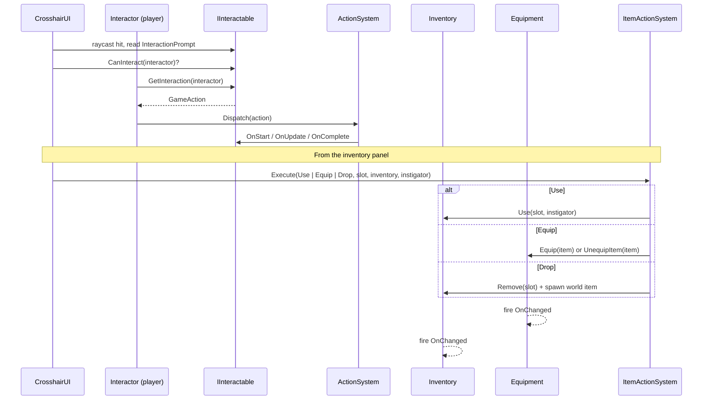

# Interactions & Inventory

*The "press E" layer, plus the Elder-Scrolls-style bag that fills up with fish.*

## Purpose

One system covers three jobs that naturally overlap:
- **World interaction** — what the crosshair is pointing at, whether it's usable, what pressing E does.
- **Inventory** — a list-style container (with stacks, capacity, gold) that both player/NPC characters and world chests share.
- **Equipment + item actions** — equipping to bones, using consumables, dropping items, and the central `ItemActionSystem` that routes all of that.

Trading between inventories (NPC and container) rides on top of the same primitives.

## Key files

- [I_Interactable.cs](../../Assets/Scripts/Interactions/I_Interactable.cs) — the `IInteractable` interface. Anything with a prompt and an interact action implements it. Also hosts `EntityCodeUtility` (the `ITM#####` / `NPC#####` / `CNT#####` / `OWN#####` id scheme).
- [Interactor.cs](../../Assets/Scripts/Interactions/Interactor.cs) — the context object passed into interactables. Wraps the acting GameObject, its `Inventory`, and its soul.
- [Inventory.cs](../../Assets/Scripts/Interactions/Inventory.cs) — list inventory. Handles stacking, capacity, gold, seed contents, lock/ownership access rules for world containers.
- [InventorySlot.cs](../../Assets/Scripts/Interactions/InventorySlot.cs) — one slot, one item reference, a stack count.
- [Equipment.cs](../../Assets/Scripts/Interactions/Equipment.cs) — slot-based equipment, bone attachment, IK activation on main-hand equip. Fires `OnChanged` for listeners like [FishingState](../../Assets/Scripts/Fishing/FishingState.cs).
- [EquipmentSlotType.cs](../../Assets/Scripts/Interactions/EquipmentSlotType.cs) — enum: Head, Chest, MainHand, OffHand, etc.
- [ItemComponent.cs](../../Assets/Scripts/Interactions/ItemComponent.cs) — the pickup-able world-item component. Carries item id, name, stackability, equip bone/offset/rotation, consumable/weapon stats.
- [ItemActionSystem.cs](../../Assets/Scripts/Interactions/ItemActionSystem.cs) / [ItemActionType.cs](../../Assets/Scripts/Interactions/ItemActionType.cs) — static router for Use / Equip / Drop on a slot. One path for UI, AI, and any other caller.
- [ItemRegistry.cs](../../Assets/Scripts/Interactions/ItemRegistry.cs) — project-wide registry backing the `[ItemIdDropdown]` inspector attribute and resolving ids to prefabs.
- [NpcTradeInteractable.cs](../../Assets/Scripts/Interactions/NpcTradeInteractable.cs) / [TradeController.cs](../../Assets/Scripts/Interactions/TradeController.cs) — NPC trade entry and the static transfer helper.
- [ContainerInteractable.cs](../../Assets/Scripts/Interactions/ContainerInteractable.cs) — chests/barrels. Reuses the trade UI in "loot" mode.
- [OwnerIdentity.cs](../../Assets/Scripts/Interactions/OwnerIdentity.cs) / [OwnerRegistry.cs](../../Assets/Scripts/Interactions/OwnerRegistry.cs) — stable owner ids (`OWN#####`) for lock/theft rules on containers.
- [BedSleepInteractable.cs](../../Assets/Scripts/Interactions/BedSleepInteractable.cs) — sleep-through-night interactable; talks to [TimeOfDay](time-of-day.md).
- [CaughtFishItem.cs](../../Assets/Scripts/Interactions/CaughtFishItem.cs) — the specialized item spawned when you land a catch.

## Entry points

- **Player/NPC:** `Inventory` + `Equipment` + an `Interactor` component on the character root.
- **World objects:** any `MonoBehaviour` implementing `IInteractable`. Current concrete ones: `ItemComponent` (pickups), `NpcTradeInteractable`, `ContainerInteractable`, `BedSleepInteractable`.
- **UI:** the [CrosshairUI](../../Assets/Scripts/UserInterface/CrosshairUI.cs) raycasts each frame and surfaces the prompt of whatever `IInteractable` is targeted.

## Interact + item-action flow

The one piece worth noting: the interact path *returns* a `GameAction` rather than doing anything directly. The interactable describes intent; the `ActionSystem` decides whether it runs. That means opening a chest, using a bed, and trading all preempt cleanly if something higher-priority kicks in mid-action.

## Containers and ownership

- Containers can be `Inventory` (player/NPC) or `Container` (world). Containers can be locked, keyed, lockpickable, and owned.
- Owner identity is stable (`OWN#####`) and survives scene reloads / saves via [OwnerRegistry](../../Assets/Scripts/Interactions/OwnerRegistry.cs).
- `InventoryAccessResult` flags what kind of denial happened — UI can show a different prompt for Locked vs. NotOwner vs. InvalidInteractor.

## Trading

`NpcTradeInteractable` returns an action that opens [TradeUI](../../Assets/Scripts/UserInterface/TradeUI.cs) with both inventories side by side. Transfers go through `TradeController` which enforces stack limits and gold, and fires `OnChanged` on both sides.

## Adding a new interactable

1. Implement `IInteractable` on your component. Return a prompt string.
2. `CanInteract(interactor)` should be cheap and side-effect-free.
3. `GetInteraction(interactor)` returns a `GameAction` — either an existing one from `ActionSystem/Actions/` or a new subclass. Return `null` to silently opt out.
4. If your interactable should be outlined on crosshair target, add an `OutlineComponent` ([Outline/Sol.OutlineComponent.cs](../../Assets/Scripts/Outline/Sol.OutlineComponent.cs)).

## Adding a new item

1. Make a prefab with `ItemComponent`. Set a unique `ITM#####` id (the `[ItemIdDropdown]` inspector helps).
2. Configure `EquipBone` / `EquipOffset` / `EquipRotation` if the item is wearable.
3. Register the prefab with [ItemRegistry](../../Assets/Scripts/Interactions/ItemRegistry.cs) so ids resolve on load.
4. If it's consumable or a weapon, fill the relevant stats on `ItemComponent`.

## Gotchas

- **`Equipment.Equip` returns `false` when the slot is occupied.** It does not auto-swap. Callers that want "equip or swap" must check `IsEquipped` + `UnequipItem` first. `ItemActionSystem.ExecuteEquip` implements the toggle pattern — copy from there.
- **World-scale is preserved across bone attach.** `Equipment.Equip` does the lossy-scale math so items don't squash when the skeleton scales. Don't bypass it by re-parenting manually.
- **Consumed inventory items are removed by slot, not by reference.** If two slots hold the same stackable item and you hand the wrong `InventorySlot` reference to `Remove`, you'll drain the wrong one. `PopItem` on a slot is the safe per-slot path.
- **`CaughtFishItem` is a subclass of `ItemComponent`.** Anything that filters by exact type (`is ItemComponent` is fine; `GetType() == typeof(ItemComponent)` is not) will miss it.
- **Locked containers respect `_requiredKeyItemName` OR `_requiredKeyItemId`.** Use the id. Names are kept for legacy data and will silently fail if renamed.
