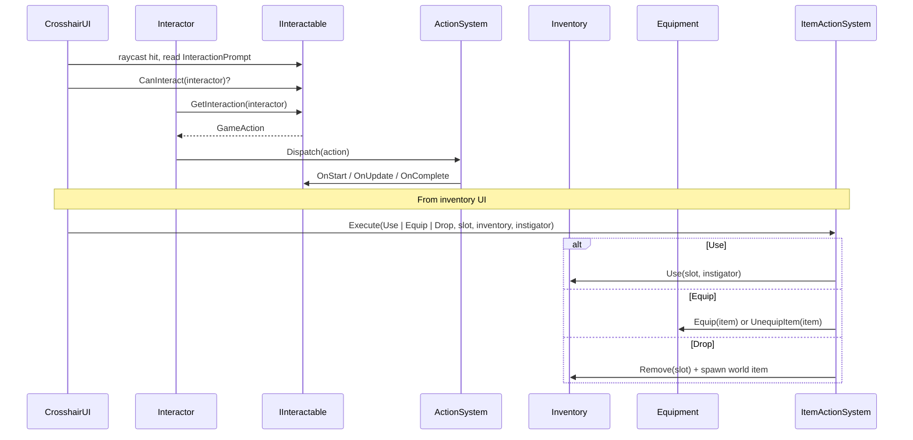

# Interactions & Inventory

*The "press E" layer, the inventory bag, world items, equipment, loot, and trading.*

## Purpose

One system covers four jobs that naturally overlap:

- **World interaction**: what the crosshair is pointing at, whether it is usable, and what pressing E does.
- **Inventory**: a list-style container with stacks, capacity, gold, seeded contents, and world-container ownership/lock rules.
- **Equipment + item actions**: equipping to bones, using consumables, dropping items, and routing item commands through `ItemActionSystem`.
- **Trading**: merchant shop trading through shop sessions, plus direct inventory transfer for loot, containers, quest delivery, and debug/free exchange.

Item design is registry-authoritative. `ItemRegistry` owns gameplay-facing design fields, item prefabs are visual/world instances, and `ItemComponent` is the runtime facade that keeps older systems working against live item objects.

## Key Files

- [I_Interactable.cs](../../Assets/Scripts/Interactables/I_Interactable.cs): `IInteractable`, id utilities, and dropdown attributes.
- [Interactor.cs](../../Assets/Scripts/Interactables/Interactor.cs): context passed into interactables; wraps the acting GameObject, inventory, and soul.
- [Inventory.cs](../../Assets/Scripts/Inventory/Inventory.cs): list inventory with stack, capacity, gold, seed contents, lock, and ownership behavior.
- [InventorySlot.cs](../../Assets/Scripts/Inventory/InventorySlot.cs): one slot, one primary item reference, stack count, and extra stacked instances.
- [Equipment.cs](../../Assets/Scripts/Inventory/Equipment.cs): slot-based equipment, bone attachment, and equipment change events.
- [EquipmentSlotType.cs](../../Assets/Scripts/Inventory/EquipmentSlotType.cs): armor, held, and sheathed equipment slot enum.
- [ItemRegistry.cs](../../Assets/Scripts/Inventory/ItemOwnership/ItemRegistry.cs): authoritative item definition registry and item-id-to-visual-prefab lookup.
- [ItemComponent.cs](../../Assets/Scripts/Inventory/ItemOwnership/ItemComponent.cs): pickup-able world item and runtime facade for registry-backed design values.
- [TradeController.cs](../../Assets/Scripts/Inventory/TradeController.cs): direct inventory-to-inventory transfer helper.
- [ShopRuntimeSession.cs](../../Assets/Scripts/RPG/ShopRuntimeSession.cs): mutable merchant shop state seeded from `RpgShopDefinition`.
- [ShopRuntimeStore.cs](../../Assets/Scripts/RPG/ShopRuntimeStore.cs): active shop session cache and restore entry point.
- [ContainerInteractable.cs](../../Assets/Scripts/Interactables/ContainerInteractable.cs): world containers that open loot/direct-transfer UI.
- [OwnerIdentity.cs](../../Assets/Scripts/Inventory/ItemOwnership/OwnerIdentity.cs) / [OwnerRegistry.cs](../../Assets/Scripts/Inventory/ItemOwnership/OwnerRegistry.cs): stable owner ids for theft and lock rules.
- [BedSleepInteractable.cs](../../Assets/Scripts/Interactables/BedSleepInteractable.cs): sleep-through-night interactable; talks to [Time of Day](time-of-day.md).
- [CaughtFishItem.cs](../../Assets/Scripts/Fishing/CaughtFishItem.cs): specialized item spawned for caught fish.

## Item Authority

`ItemRegistry.Entry` is the design record. It owns:

- `ItemId`, display name, type, value, icon, and flavor text.
- Stackability, max stack size, consumable flag, and tradeability.
- Use occasion and use effects.
- Damage, defense, equip domain, handing, equip socket, offsets, and allowed equip slots.
- Authoring template/notes.
- Visual/world prefab reference.

`ItemComponent` keeps per-instance/runtime state:

- Item id.
- Owner id and stolen state.
- Pickup grip and world/equip transform hooks.
- Runtime fish code or other specialized dynamic state.
- The actual GameObject used for pickups, equipped visuals, inventory previews, and trade previews.

When a live item asks for `ItemName`, `Value`, `Icon`, `UseEffects`, `Damage`, or similar fields, `ItemComponent` resolves the definition from `ItemRegistry`. Missing definitions fall back to legacy serialized values with a warning instead of crashing.

## Entry Points

- **Player/NPC:** `Inventory` + `Equipment` + an `Interactor` component on the character root.
- **World objects:** any `MonoBehaviour` implementing `IInteractable`; common examples are item pickups, containers, beds, and workstations.
- **UI:** [CrosshairUI](../../Assets/Scripts/UserInterface/CrosshairUI.cs) raycasts and triggers the selected interactable action.
- **Item design lookup:** call `ItemRegistry.Get().GetDefinition(itemId)` for design data, or use `ItemComponent` when working with a live item.
- **Merchant shop lookup:** trader NPCs carry a `SHP#####` shop id. `ShopRuntimeStore.GetOrCreateSession(shopId)` resolves and seeds the shop session.

## Interact + Item Action Flow

The interact path returns a `GameAction` rather than performing work immediately. The interactable describes intent; the `ActionSystem` decides whether it runs.

## Trading

There are two trading paths.

**Merchant shops:** trader NPCs use a shop id. Dialogue or interaction opens [TradeUI](../../Assets/Scripts/UserInterface/TradeUI.cs) in shop mode with the player inventory on one side and a `ShopRuntimeSession.Inventory` on the other. Buying and selling mutate the shop session, not the authored `RpgShopDefinition`.

Price rules:

- Buy price = registry item value x shop buy multiplier x stock entry price multiplier.
- Sell price = registry item value x shop sell multiplier.
- Nonzero-value buyable items cost at least 1g.

**Direct inventory transfer:** corpse loot, world containers, quest delivery, and free/debug exchange still use `TradeController` against two inventories. This preserves existing loot/container behavior and does not require a shop definition.

NPC inventory seed contents are no longer merchant stock. NPC inventories remain valid for non-shop possessions, loot, and direct transfer paths.

## Containers And Ownership

- Containers can be `Inventory` or `Container` mode.
- World containers can be locked, keyed, lockpickable, and owned.
- Owner identity is stable (`OWN#####`) and survives scene reloads/saves via `OwnerRegistry`.
- `InventoryAccessResult` distinguishes locked, not-owner, invalid interactor, and allowed results.

## Adding A New Item

1. Open `Window/Sol/Database` and create the item in the `Items` tab.
2. Fill registry design fields: name, type, value, icon, flavor text, stack rules, tradeability, use effects, equipment stats, and notes.
3. Assign or create a visual/world prefab with `ItemComponent`.
4. Put pickup/equipment visuals, preview mesh/material setup, pickup grip, and specialized runtime components on the prefab.
5. Author gameplay values in the registry, not on prefab legacy fields.

To migrate older prefab-authored items, run `Tools/Sol/Items/Migrate Prefab Design Into Registry`, then resolve drift warnings in the database overview.

## Adding Merchant Stock

1. Open `Window/Sol/Database` -> `Shops`.
2. Create or open a `RpgShopDefinition`.
3. Add stock rows by item id from `ItemRegistry`.
4. Set shop gold, buy/sell multipliers, stock entry price multipliers, and restock mode.
5. Assign the shop id to the trader NPC in the NPC authoring UI.
6. Keep NPC inventory for non-shop possessions or loot only.

## Gotchas

- `Equipment.Equip` returns `false` when the slot is occupied. Callers that want equip-or-swap should follow the `ItemActionSystem.ExecuteEquip` pattern.
- World scale is preserved across bone attach. Do not bypass `Equipment` by re-parenting equipped items manually.
- Consumed inventory items are removed by slot, not by reference. Use `InventorySlot.PopItem()` for per-instance stack handling.
- `CaughtFishItem` is a subclass of `ItemComponent`. Type checks should use `is ItemComponent`, not exact type equality.
- Locked containers respect required key name or required key id. Prefer id; names are legacy.
- Item prefabs are not design authority. They still render, equip, preview, and host specialized components, but gameplay-facing values come from `ItemRegistry`.
- `RpgShopDefinition` is authored seed data, not mutable runtime state. Runtime shop stock and gold live in `ShopRuntimeSession` and save/load through shop save data.
