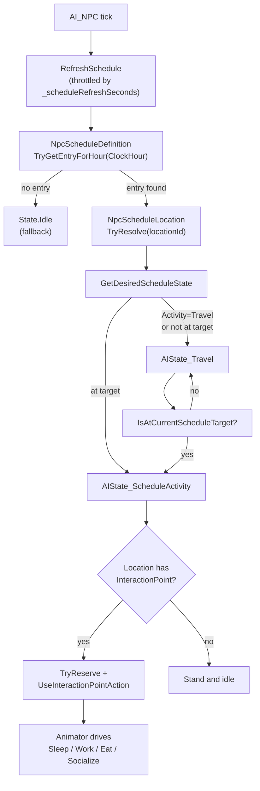
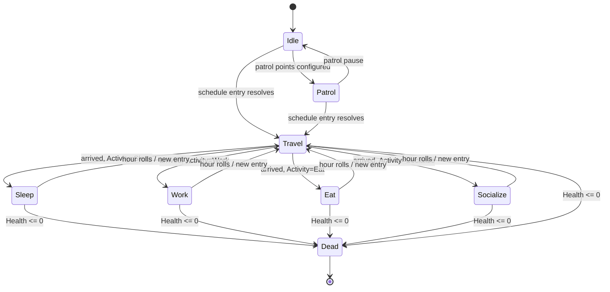

# NPC Schedules

*Where an NPC is supposed to be at any given hour, and what they're supposed to be doing there.*

## Purpose

The schedule system gives each NPC a 24-hour authored routine. At runtime the `AI_NPC` polls the in-game hour, finds the matching schedule entry, picks a target `NpcScheduleLocation` in the scene, walks there via NavMesh, and — if the location exposes an `InteractionPoint` — engages it (sit at the bar, sleep in the bed, work the anvil). When the hour rolls into a new entry, the NPC retargets.

This is the lived-in-world layer: it's how the baker is at the oven at dawn and the tavern by dusk without authoring a behaviour tree per NPC.

## Key Files

- [NpcScheduleDefinition.cs](../../Assets/Scripts/NPCs/NpcScheduleDefinition.cs) — `ScriptableObject` with the list of `NpcScheduleEntry` and the `NpcScheduleActivity` enum.
- [NpcScheduleLocation.cs](../../Assets/Scripts/NPCs/NpcScheduleLocation.cs) — scene component that registers a `locationId` and resolves a NavMesh-snapped anchor (optionally an attached `InteractionPoint`).
- [AI_NPC.Schedule.cs](../../Assets/Scripts/NPCs/AI_NPC.Schedule.cs) — schedule driver on the NPC: refresh, resolve target, decide desired state.
- [States/AIState_Schedule.cs](../../Assets/Scripts/NPCs/States/AIState_Schedule.cs) — contains both `AIState_Travel` (path to location) and `AIState_ScheduleActivity` (idle + drive the location's `InteractionPoint`).
- [States/AIState_Idle.cs](../../Assets/Scripts/NPCs/States/AIState_Idle.cs), [States/AIState_Patrol.cs](../../Assets/Scripts/NPCs/States/AIState_Patrol.cs) — fallback states when no schedule is assigned.
- [Editor/NpcScheduleRouteGizmoDrawer.cs](../../Assets/Scripts/NPCs/Editor/NpcScheduleRouteGizmoDrawer.cs) — scene-view gizmos visualising an NPC's daily route.
- [TimeOfDay/TimeofDay.cs](../../Assets/Scripts/TimeOfDay/TimeofDay.cs) — exposes `ClockHour`, the schedule's clock input.

## Authoring Model

A schedule is a `ScriptableObject` asset (`Sol/NPC Schedule`, file id `SCH#####`). Each entry is:

| Field | Meaning |
|-------|---------|
| `StartHour` / `EndHour` | 0–24 window. May wrap (e.g. 22 → 6 spans midnight). |
| `LocationId` | Case-insensitive id matching an `NpcScheduleLocation` in the scene. |
| `Activity` | `Travel`, `Sleep`, `Work`, `Eat`, or `Socialize`. |
| `WaitSeconds` | Optional minimum dwell time at the location (also feeds the `InteractionPoint` reservation length). |
| `UseLocationFacing` | If true and the location has `UseFacing`, snap rotation to the anchor's forward on arrival. |

An NPC references one `NpcScheduleDefinition` in the inspector (`_scheduleDefinition`) plus a refresh interval and route-preview options.

`NpcScheduleLocation` is a scene MonoBehaviour. It self-registers in a static map on enable, exposes an optional `InteractionPoint` (auto-resolved from a child if not assigned), and samples the NavMesh within `_navMeshSnapDistance` so the anchor stays walkable even if it's placed slightly inside geometry.

## Runtime Flow

## State Transitions

`State.Chase` is reserved but not yet wired; the schedule driver short-circuits if `CanChasePlayer()` returns true.

## Interaction at the Destination

`AIState_ScheduleActivity` does *not* play an animation directly — it routes through the [Interactables](interactables.md) layer:

1. On `Enter`, it stops the `NavMeshAgent`, applies schedule facing, and primes a fresh `Interactor` for the NPC.
2. If the resolved `NpcScheduleLocation` has an `InteractionPoint`, the state calls `TryReserve` with a duration of `WaitSeconds + 1s` (min 1s).
3. On success, it dispatches an `InteractAction` through the `ActionSystem`, which produces a `UseInteractionPointAction` (the NPC's hands are now tied to the point).
4. When `UseInteractionPointAction.HasResolved` flips true the activity is considered done for this hour; the NPC keeps standing on the spot until the schedule rolls.
5. On `Exit` (e.g. hour change or death), `EndActiveInteraction` releases the reservation cleanly so another NPC can use the spot.

## Authoring a Schedule

1. `Create → Sol → NPC Schedule` to make a new `NpcScheduleDefinition` asset.
2. Add entries covering as much of the 24-hour day as you want (gaps fall back to `Idle`/`Patrol`). Wrap entries by setting `EndHour < StartHour`.
3. In the scene, place empty GameObjects with `NpcScheduleLocation` at every named spot (bed, anvil, market stall, hearth) and give each a unique `LocationId`. If the spot should drive an animation/use, add an `InteractionPoint` (or its `Harvestable`/`WaterSource` subclass) as a child or sibling.
4. Assign the schedule asset to the NPC's `_scheduleDefinition` and verify the route gizmo (Scene view; toggle `_showScheduleRoute` if you don't see it).
5. Make sure the NPC and locations are on a NavMesh.

## Persistence

Schedules are **not** serialized. After load, `SaveManager.ApplyRestore` calls `SnapToCurrentScheduleTarget` on every NPC that has a schedule definition, which:

- forces a `RefreshSchedule(force: true)`,
- warps the `NavMeshAgent` to the resolved schedule target,
- applies schedule facing.

This means a save written at 14:00 loads with NPCs already at their 14:00 posts, not back where they were when you hit save. The schedule is the source of truth; the save just restores the clock.

See [Save System](save-system.md).

## Gotchas

- **`LocationId` is case-insensitive but whitespace-sensitive** after trim. Mis-typed ids silently route NPCs to `Idle`.
- **Wrap-around entries** (`StartHour > EndHour`) work, but **identical start/end** (`ContainsHour` returns false on equal start/end) match nothing — gap, not 24-hour entry.
- **Only one entry can match a given hour.** Definition lookup is first-match; author overlapping windows at your own risk. `NpcScheduleDefinition.HoursOverlap` is provided for editor validation.
- **`InteractionPoint.SingleOccupancy`** means two NPCs scheduled to the same bed/stool at the same time will fight over the reservation — the loser stands next to the point without animating. Author multiple locations or stagger entries.
- **`Travel` activity at a location** means the NPC is supposed to be *passing through*: it never enters `AIState_ScheduleActivity`, it just walks to the spot and reverts to schedule logic. Use it for waypoints between real activity stops.
- **No schedule definition = no scheduled behaviour.** The NPC falls through to `Idle` (and into `Patrol` if it has patrol points). This is the intended way to keep wandering townsfolk and guards alongside scheduled ones.
- **Schedule does not persist across saves**; only the clock does. Don't author logic that assumes mid-activity state survives load.
