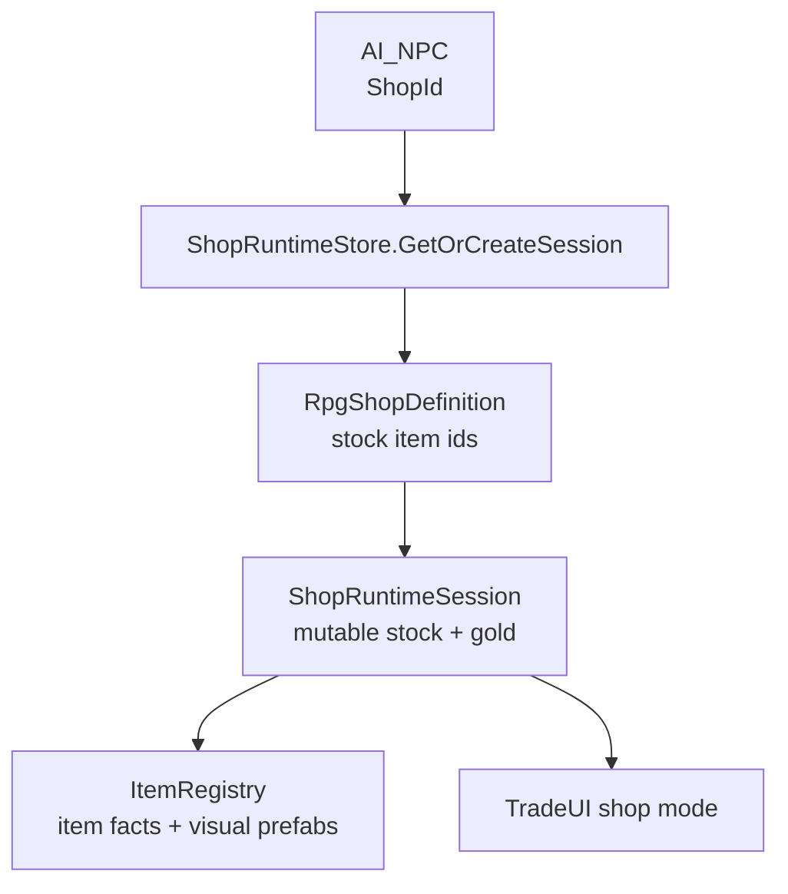
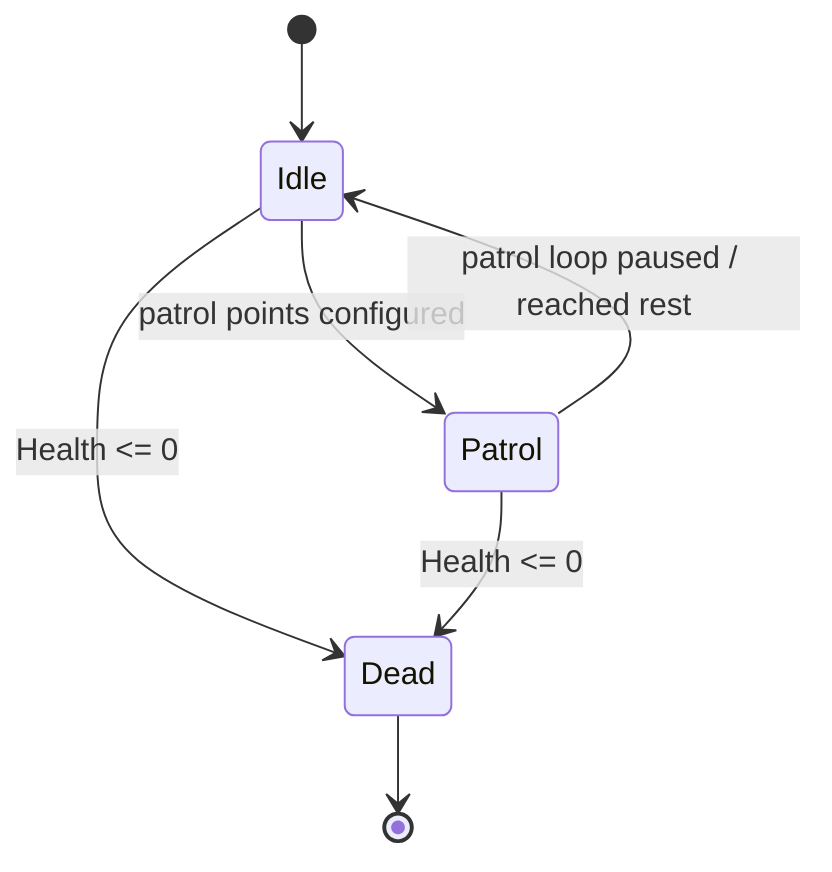

# NPCs

*Townsfolk, guards, quest givers, bandits, and traders. They own pathing, dialogue hooks, identity, and optional shop ids.*

## Purpose

NPC characters use the same locomotion and soul stack as the player, but their intent comes from AI states instead of input. Each NPC has a `NavMeshAgent`, locomotion components, `NPCSoul` identity, and an `AI_NPC` partial class that coordinates state, dialogue, inventory, death/loot, and trading.

The authoring tool seeds NPCs from archetypes such as `Civilian`, `Guard`, `Bandit`, `Quest Giver`, and `Unique`. Traders now use shop ids for merchant stock. NPC inventory still exists, but it is no longer the source of merchant shop stock.

## Key Files

- [AI_NPC.cs](../../Assets/Scripts/NPCs/AI_NPC.cs): partial class root and required component declarations.
- [AI_NPC.Core.cs](../../Assets/Scripts/NPCs/AI_NPC.Core.cs): main behavior loop, state switching, and public surface.
- [AI_NPC.Locomotion.cs](../../Assets/Scripts/NPCs/AI_NPC.Locomotion.cs): active-state locomotion intent into `NavMeshAgent`.
- [AI_NPC.Animation.cs](../../Assets/Scripts/NPCs/AI_NPC.Animation.cs): animator parameter mapping.
- [AI_NPC.Inventory.cs](../../Assets/Scripts/NPCs/AI_NPC.Inventory.cs): NPC-side inventory support.
- [AI_NPC.Shop.cs](../../Assets/Scripts/NPCs/AI_NPC.Shop.cs): trader surface, shop id, shop-session opening, and legacy direct trade fallback.
- [AIConfig.cs](../../Assets/Scripts/NPCs/AIConfig.cs): authored per-NPC config.
- [NPCSoul.cs](../../Assets/Scripts/NPCs/NPCSoul.cs): persistent NPC identity and character facts.
- [IntentContext.cs](../../Assets/Scripts/NPCs/IntentContext.cs): glue between AI intent and locomotion.
- [NPCAuthoringDrawerUtility.cs](../../Assets/Scripts/NPCs/Editor/NPCAuthoringDrawerUtility.cs): grouped NPC inspector UI, including shop id dropdown.
- [NPCAuthoringValidator.cs](../../Assets/Scripts/NPCs/Editor/NPCAuthoringValidator.cs): NPC authoring warnings, including missing/invalid shop ids.
- [ShopRuntimeStore.cs](../../Assets/Scripts/RPG/ShopRuntimeStore.cs): resolves a trader's shop id into a mutable runtime session.
- **States:** [States/](../../Assets/Scripts/NPCs/States/) contains idle, patrol, dead, and shared state base classes.
- **Prefabs:** [NPCs/Prefabs/](../../Assets/Scripts/NPCs/Prefabs/).

## Entry Points

- `AI_NPC` is the single behavior component on an NPC root. It requires and resolves navigation, locomotion, inventory, and dialogue/trade pieces.
- Conversations call `BeginConversation()` / `EndConversation()` on `AI_NPC`, which propagates to locomotion conversation state.
- Trader interaction/dialogue asks `AI_NPC` for its trade action.
- If `AI_NPC.ShopId` resolves to a `RpgShopDefinition`, trade opens a `ShopRuntimeSession`.
- If no shop id is assigned, legacy direct inventory trade can still be used where appropriate.

## Trading Model

Trader NPCs should use `SHP#####` shop ids for paid merchant trading:

Authoring rules:

- Assign the shop id in the NPC authoring UI.
- Author merchant stock in the `Shops` tab, not in the NPC inventory.
- NPC inventory remains for non-shop possessions, loot, quest delivery, and direct/free transfer.
- Trader dialogue without a valid shop id warns and does not open a broken paid trade UI.

## AI State Transitions

The `State.Chase` enum value is reserved, but no complete chase state is wired yet.

## Persistence

NPCs persist through `NPCSoul`. Save/load captures each soul's position, rotation, health, current state, conversation-ready flags, and non-shop inventory.

Merchant shop stock/gold does not persist through NPC inventory. It persists through `ShopSaveData` and restores through `ShopRuntimeStore`.

## Adding A New NPC

1. Use `Window/Sol/Database` -> `NPCs` or duplicate a prefab under [NPCs/Prefabs/](../../Assets/Scripts/NPCs/Prefabs/).
2. Assign/fix a stable owner id through the database tools.
3. Configure archetype, AI config, patrol points, inventory, dialogue, and death/loot.
4. For a merchant, create a `RpgShopDefinition` in the `Shops` tab and assign its shop id to the NPC.
5. Place in-scene on a NavMesh.

## Gotchas

- Start from an NPC prefab. Required components are strict, and Unity auto-add order can hide broken defaults.
- Dead NPCs stop ticking. Loaded dead state has no post-load death grace period.
- Starting a conversation does not automatically stop the `NavMeshAgent`; the active state must provide zero movement if the NPC should stand still.
- `State.Chase` is a placeholder until a concrete chase state lands.
- Merchant stock belongs to `RpgShopDefinition` and `ShopRuntimeSession`, not the NPC inventory seed list.
