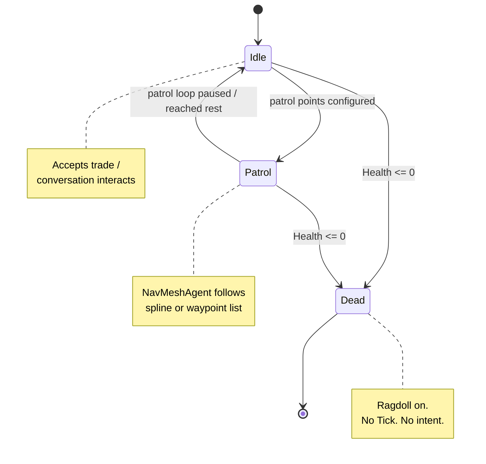

# NPCs

*The people standing around the pond. Some trade. Some don't. All of them own their pathing.*

## Purpose

NPC characters — traders, idlers, patrollers — built on the same locomotion stack as the player, but fed by a simple state machine instead of input. Each NPC has a `NavMeshAgent`, a `LocomotionController`, and an `AIStateBase` subclass deciding what it wants to do this tick.

## Key files

- [AI_NPC.cs](../../Assets/Scripts/NPCs/AI_NPC.cs) — partial class root. Lists `[RequireComponent]`s and exposes the conversation hooks.
- [AI_NPC.Core.cs](../../Assets/Scripts/NPCs/AI_NPC.Core.cs) — main behaviour loop, state switching, public surface.
- [AI_NPC.Locomotion.cs](../../Assets/Scripts/NPCs/AI_NPC.Locomotion.cs) — intent translation: turns the active state's `LocomotionIntent` into `NavMeshAgent` destinations.
- [AI_NPC.Animation.cs](../../Assets/Scripts/NPCs/AI_NPC.Animation.cs) — animator parameter mapping (speed, conversing, dead).
- [AI_NPC.Inventory.cs](../../Assets/Scripts/NPCs/AI_NPC.Inventory.cs) — NPC-side inventory seeding and trade integration.
- [AIConfig.cs](../../Assets/Scripts/NPCs/AIConfig.cs) — authored per-NPC config (speeds, patrol radii, idle timings).
- [NPCSoul.cs](../../Assets/Scripts/NPCs/NPCSoul.cs) — persistent NPC identity. Survives save/load; carries the stable `NPC#####` id.
- [IntentContext.cs](../../Assets/Scripts/NPCs/IntentContext.cs) — glue between AI intent and the shared locomotion intent provider contract.
- [NPC.asset](../../Assets/Scripts/NPCs/NPC.asset) / [Trader_Elsbeth.asset](../../Assets/Scripts/NPCs/Trader_Elsbeth.asset) — authored NPC configs.
- **States:**
  - [States/AIStateBase.cs](../../Assets/Scripts/NPCs/States/AIStateBase.cs) — abstract base. `Enter` / `Exit` / `Tick` / `GetIntent`.
  - [States/AIState_Idle.cs](../../Assets/Scripts/NPCs/States/AIState_Idle.cs) — stand there, optionally look at the player.
  - [States/AIState_Patrol.cs](../../Assets/Scripts/NPCs/States/AIState_Patrol.cs) — follow a spline or waypoint loop.
  - [States/AIState_Dead.cs](../../Assets/Scripts/NPCs/States/AIState_Dead.cs) — ragdoll hand-off; no intent, no tick-out.
- **Prefabs:** [NPCs/Prefabs/](../../Assets/Scripts/NPCs/Prefabs/).

## Entry points

- `AI_NPC` is the single MonoBehaviour on an NPC root. It requires (and auto-resolves) `NavMeshAgent`, `CharacterController`, and the full locomotion stack.
- Trading is wired through [NpcTradeInteractable](../../Assets/Scripts/Interactions/NpcTradeInteractable.cs) on the NPC, which implements `IInteractable` and returns the trade-opening `GameAction`.
- Conversations call `BeginConversation()` / `EndConversation()` on `AI_NPC` which propagates to `LocomotionController.IsConversing` (suppresses rotation).

## AI state transitions



The `State` enum in [AI_NPC.cs](../../Assets/Scripts/NPCs/AI_NPC.cs) names `Chase` too, but no concrete `AIState_Chase` exists in the States folder yet — it's reserved for hostile NPCs and is currently a stub.

## Intent → locomotion

```
AIStateBase.Tick() ─► returns next State enum
AIStateBase.GetIntent() ─► LocomotionIntent (direction, speed, sprint flag)
AI_NPC.Locomotion (partial) ─► feeds intent into LocomotionController via ILocomotionIntentProvider
NavMeshAgent ─► carries the character along the computed path
LocomotionAnimation ─► reads resulting velocity, drives animator
```

The NavMeshAgent is the *actual* mover; the `CharacterController` follows. If pathing breaks (`IsPathInvalid`), the state should re-plan rather than lurching — see how `AIState_Patrol` handles stale paths.

## Persistence

NPCs persist via `NPCSoul`. On save, [SaveManager](../../Assets/Scripts/Management/SaveManager.cs) collects each soul's `NPCSaveData` (position, rotation, health, inventory, current state). On load, souls are matched back to in-scene NPCs by their stable id and rehydrated.

## Adding a new state

1. Subclass `AIStateBase` in [States/](../../Assets/Scripts/NPCs/States/). Implement `Enter`, `Exit`, `Tick`, `GetIntent`.
2. Add a value to `AI_NPC.State` enum in [AI_NPC.cs](../../Assets/Scripts/NPCs/AI_NPC.cs).
3. Wire it into `AI_NPC.Core` so the new enum value instantiates your class.
4. If it needs new authored data (e.g. flee radius), extend [AIConfig.cs](../../Assets/Scripts/NPCs/AIConfig.cs) and reference from the state.

## Adding a new NPC

1. Duplicate a prefab under [NPCs/Prefabs/](../../Assets/Scripts/NPCs/Prefabs/) and an `NPC.asset` config.
2. Assign a unique `NPC#####` id to the `NPCSoul`.
3. If tradeable, add [NpcTradeInteractable](../../Assets/Scripts/Interactions/NpcTradeInteractable.cs) and seed an inventory.
4. Place in-scene on a NavMesh.

## Gotchas

- **`[RequireComponent]` is strict.** Drop an AI_NPC on an object without a `CharacterController` *and* a `NavMeshAgent` *and* the whole locomotion stack, and Unity will noisily silently add them in whatever order — leading to default speeds and broken animation hookups. Always start from a prefab.
- **Dead NPCs stop ticking.** If you save while an NPC is mid-death animation, the loaded state is `Dead` with no extra grace period. That's intentional, but don't expect post-death cleanup logic to run on load.
- **Conversation rotation suppression only applies while `IsConversing` is true.** Starting a conversation doesn't stop the `NavMeshAgent`. If you want the NPC to stand still and face the player, the state's `GetIntent` must return zero velocity for the conversation's duration.
- **The `Chase` state is a placeholder.** Don't assume `State.Chase` works end-to-end until a concrete `AIState_Chase` lands.
