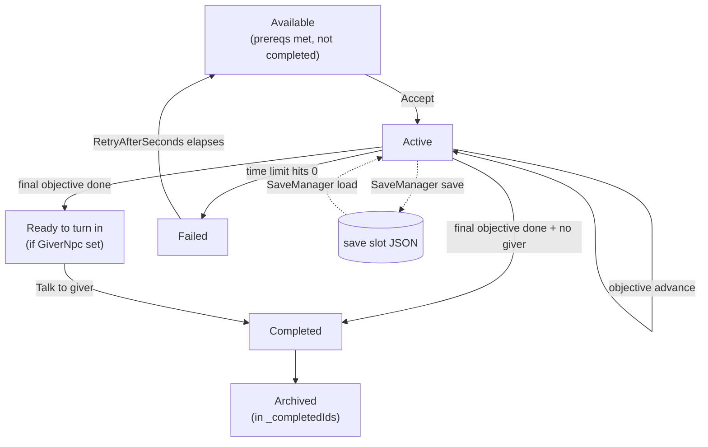

# Quests

*The bookkeeper. Remembers what you said you'd do and pokes you when you do it.*

## Purpose

Authored quests become runtime state the moment the player accepts them, and stay as runtime state until they're completed, failed, or expired. The manager listens to game-world signals (catches, items collected, NPCs spoken to, items equipped) and advances the current sequential objective when the signal matches. Progress persists through [SaveManager](save-system.md).

## Key files

- [QuestManager.cs](../../Assets/Scripts/Quests/QuestManager.cs) — the singleton. Holds active quests, subscribes to player inventory/equipment and the `ActionSystem`, ticks timed quests.
- [QuestDefinition.cs](../../Assets/Scripts/Quests/QuestDefinition.cs) — authored `ScriptableObject`. Id (`QST#####`), title, summary, giver, objectives, reward, prerequisites, optional time limit.
- [QuestObjective.cs](../../Assets/Scripts/Quests/QuestObjective.cs) — one objective. Types: `CatchCount`, `CatchTotalValue`, `CatchRarity`, `CatchByPrefix`, `CollectItem`, `DeliverItem`, `TalkToNpc`, `EquipItem`. The `Catch*` types are fishing-flavored shortcuts on top of an otherwise generic RPG objective system; `CollectItem`, `DeliverItem`, `TalkToNpc`, and `EquipItem` carry the non-fishing RPG content. Objectives run **in order** — you finish objective 0 before objective 1 starts watching.
- [QuestReward.cs](../../Assets/Scripts/Quests/QuestReward.cs) — gold, items, and future hooks for non-material rewards.
- [QuestRegistry.cs](../../Assets/Scripts/Quests/QuestRegistry.cs) — the project-wide list of all quest definitions; backs the offer queries.
- [QuestSaveData.cs](../../Assets/Scripts/Quests/QuestSaveData.cs) — per-quest runtime state serialized into the save file (`SaveVersion ≥ 4`).
- [QuestBoardInteractable.cs](../../Assets/Scripts/Quests/QuestBoardInteractable.cs) — world object that offers board-only quests (quests with no `GiverNpcName`).
- **UI:** [UserInterface/QuestTrackerHUD.cs](../../Assets/Scripts/UserInterface/QuestTrackerHUD.cs) — on-screen tracker for the actively tracked quest.

## Entry points

- `QuestManager` lives on a persistent GameObject (put it next to [SaveManager](../../Assets/Scripts/Management/SaveManager.cs)).
- Quest offer surfaces:
  - `NpcTradeInteractable` — NPC trade screens can surface quests where `GiverNpcName` matches the NPC.
  - `QuestBoardInteractable` — boards surface quests with empty `GiverNpcName`.
  - `AutoOffer` — quests flagged auto-offer are dispatched on first game start when prerequisites pass (used for tutorials).

## Quest lifecycle

Events surfaced by `QuestManager`:
- `OnQuestAccepted`
- `OnObjectiveAdvanced`
- `OnQuestUpdated` — fired every tick for timed quests, plus on state changes
- `OnQuestCompleted`
- `OnQuestFailed`

## How objectives advance

`QuestManager` wires up listeners at startup:
- Player `Inventory.OnChanged` / `Equipment.OnChanged` — drives `CollectItem`, `DeliverItem`, `EquipItem`, and catch-counted objectives when a fish enters inventory.
- `ActionSystem.OnActionCompleted` — drives `TalkToNpc` (when the interact action targeting that NPC completes).

Catch-style objectives dedupe by fish id, so catching the same fish twice by save-scumming doesn't double-count (`_countedFishByQuest`).

## Timed quests

If `QuestDefinition.IsTimed` is true, `QuestManager.Update` ticks `RemainingSeconds` with `Time.unscaledDeltaTime` — meaning pausing gameplay via `Time.timeScale = 0` or opening a blocking UI freezes the clock. That's intentional: players shouldn't lose a quest because they opened the settings menu.

## Adding a new quest

1. Right-click in the project → `Sol/Quests/Quest Definition`. Fill in:
   - Id (`QST#####`), title, summary.
   - `GiverNpcName` if it turns in at an NPC; leave empty for board quests.
   - `Objectives` list — add them in the order the player must complete them.
   - `Reward` (gold + items).
   - Optional: `PrerequisiteQuestIds`, `TimeLimitSeconds`, `RetryAfterSeconds`, `AutoOffer`.
2. Add the asset to the `QuestRegistry` (or ensure it's in a path the registry scans).
3. Test: accept, progress, complete, save/load, restart.

## Adding a new objective type

1. Add a value to `QuestObjectiveType` in [QuestObjective.cs](../../Assets/Scripts/Quests/QuestObjective.cs).
2. Add the matching progress fields to `QuestObjective` (or reuse existing ones).
3. In [QuestManager.cs](../../Assets/Scripts/Quests/QuestManager.cs), find the advancement handler for the closest existing type and add a branch for yours. Fire `OnObjectiveAdvanced` when you tick progress.
4. Bump `GameSaveData.CurrentVersion` in [SaveData.cs](../../Assets/Scripts/Management/SaveData.cs) only if the persisted `QuestSaveData` shape changes.

## Gotchas

- **Objectives are sequential, not parallel.** `_currentObjectiveIndex` advances by one. If you want "do any 2 of 3", you'll need to redesign — that shape doesn't exist today.
- **`OnQuestUpdated` fires every frame for timed quests.** Don't hook it with expensive UI updates; bind to `OnObjectiveAdvanced` for non-timer state changes.
- **Auto-offer runs via a coroutine on a persistent runner** ([PersistentCoroutineRunner](../../Assets/Scripts/UserInterface/PersistentCoroutineRunner.cs)). If you tear down the `QuestManager` mid-game, the coroutine carries on pointing at a null instance — the singleton pattern here assumes "created once, never destroyed."
- **Catch-count objectives dedupe by fish id.** If you're writing a quest around "catch 5 identical fish on purpose," that won't do what you expect.
