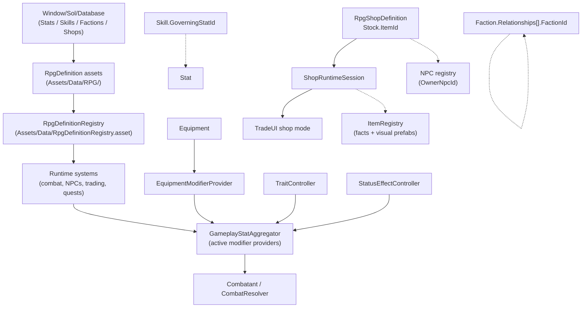

# RPG

*Stats, skills, factions, traits, status effects, runtime stat modifiers, and shops as ScriptableObjects, plus the shop runtime layer that turns authored stock into tradeable inventory.*

## Purpose

The RPG system is the authored data spine for character progression, social standing, combat math, and economy. Stats, skills, factions, shops, traits, gameplay tags, and status effects are `ScriptableObject` definitions derived from [RpgDefinition](../../Assets/Scripts/RPG/RpgDefinition.cs) or adjacent RPG definition types. A single [RpgDefinitionRegistry](../../Assets/Scripts/RPG/RpgDefinitionRegistry.cs) asset under [Assets/Data/](../../Assets/Data/) collects them for runtime lookup.

Runtime combat-facing numbers are evaluated through `GameplayStatSystem`. Traits, status effects, equipped items, and any component implementing `IGameplayStatModifierProvider` can add stat modifiers. `GameplayStatAggregator` caches the active providers on each actor and refreshes when equipment, traits, or status effects change.

Shops connect RPG definitions to items and trading. `RpgShopDefinition` owns merchant stock authoring by item id. `ShopRuntimeSession` owns mutable shop state: current stock, current gold, prices, and restock timing. Item facts such as name, value, icon, tradeability, and equipment stats still come from [ItemRegistry](../../Assets/Scripts/Inventory/ItemOwnership/ItemRegistry.cs).

Authoring lives in the consolidated database window. See [Database Authoring](database-authoring.md).

## Key Files

- [RpgDefinition.cs](../../Assets/Scripts/RPG/RpgDefinition.cs): abstract base with `Id`, `DisplayName`, and `Description`.
- [RpgDefinitionIds.cs](../../Assets/Scripts/RPG/RpgDefinitionIds.cs): id prefix constants: `STA`, `SKL`, `FAC`, `SHP`.
- [RpgStatDefinition.cs](../../Assets/Scripts/RPG/RpgStatDefinition.cs): stat category, base/min/max value, and optional use-based improvement flag.
- [RpgSkillDefinition.cs](../../Assets/Scripts/RPG/RpgSkillDefinition.cs): skill category, optional governing stat id, max level, use-XP multiplier, and starts-known flag.
- [RpgFactionDefinition.cs](../../Assets/Scripts/RPG/RpgFactionDefinition.cs): faction flags and `RpgFactionRelationship` entries.
- [RpgShopDefinition.cs](../../Assets/Scripts/RPG/RpgShopDefinition.cs): authored shop seed data: owner, faction, gold, buy/sell multipliers, restock mode, and stock rows by item id.
- [ShopRuntimeSession.cs](../../Assets/Scripts/RPG/ShopRuntimeSession.cs): mutable runtime shop session seeded from a shop definition.
- [ShopRuntimeStore.cs](../../Assets/Scripts/RPG/ShopRuntimeStore.cs): active shop session cache, lookup, clear, and restore support.
- [RpgDefinitionRegistry.cs](../../Assets/Scripts/RPG/RpgDefinitionRegistry.cs): typed definition registry exposing `GetStat`, `GetSkill`, `GetFaction`, and `GetShop`.
- [GameplayStatModifier.cs](../../Assets/Scripts/RPG/GameplayStatModifier.cs): built-in stat ids, modifier operations, provider interface, and stat evaluation rules.
- [GameplayStatAggregator.cs](../../Assets/Scripts/RPG/GameplayStatAggregator.cs): actor-local cache of active stat modifier providers.
- [EquipmentModifierProvider.cs](../../Assets/Scripts/RPG/EquipmentModifierProvider.cs): bridges equipped item stat modifiers into the actor stat pipeline.
- [IActorVitals.cs](../../Assets/Scripts/RPG/IActorVitals.cs): shared health/stamina contract consumed by combat.
- [StatIdDropdownAttribute.cs](../../Assets/Scripts/RPG/StatIdDropdownAttribute.cs): inspector dropdown for built-in and registry-backed stat ids.

## Id Scheme

| Type | Prefix | Asset menu |
|------|--------|------------|
| Stat | `STA#####` | `Sol/RPG/Stat Definition` |
| Skill | `SKL#####` | `Sol/RPG/Skill Definition` |
| Faction | `FAC#####` | `Sol/RPG/Faction Definition` |
| Shop | `SHP#####` | `Sol/RPG/Shop Definition` |

Cross-references are stored as string ids, not direct object references. Reference dropdowns in the database window write ids for stats, skills, factions, shops, items, NPCs, and quests.

## Entry Points

- **Authoring:** `Window/Sol/Database` -> `Stats`, `Skills`, `Factions`, or `Shops`.
- **Definition lookup:** `RpgDefinitionRegistry.Get()` then `GetStat`, `GetSkill`, `GetFaction`, or `GetShop`.
- **Gameplay tag lookup:** `RpgDefinitionRegistry.Get()` then `GetGameplayTag`, or query a runtime `IGameplayTagProvider.Tags`.
- **Runtime stat evaluation:** `GameplayStatSystem.Evaluate(statId, baseValue, targetGameObject)`.
- **Shop runtime lookup:** `ShopRuntimeStore.GetOrCreateSession(shopId)` when a trader NPC or dialogue action opens merchant trading.
- **Direct asset creation:** Unity `Assets/Create/Sol/RPG/...`; the registry picks up new assets on editor sync.

## Gameplay Tags

Gameplay tags are the shared authoring and runtime language for flexible sandbox gating. Use them when a designer wants an object to be treated as a category, role, affordance, law state, or condition without adding another bespoke bool or enum branch.

Current top-level categories include:

- `Actor`, `Job`, `Faction`, `Status`, `Trait`, `Skill`, `Damage`, and `Defense`.
- `Item`, including affordance/category tags such as `Item.Tradeable`, `Item.Consumable`, `Item.Equipment`, `Item.Weapon`, `Item.Armor`, `Item.Key`, `Item.Currency.Gold`, `Item.Fishing.Rod`, `Item.Fishing.Bait`, `Item.Fishing.Lure`, and `Item.Fishing.Caught`.
- `Interaction`, including `Interaction.Rest`, `Interaction.Sleep`, `Interaction.Work`, `Interaction.Shop`, `Interaction.Harvestable`, `Interaction.WaterSource`, `Interaction.Crafting`, `Interaction.Fishing`, and `Interaction.Social`.
- `Fish`, including `Fish.Predator` and `Fish.Rarity.*`.
- `Location`, `Surface`, `State`, `Action`, `Ownership`, and `Crime`.

Query rules:

- Prefer `HasTagOrChild("Path.To.Tag")`. A query for `Item.Fishing` matches `Item.Fishing.Rod`, `Item.Fishing.Bait`, and `Item.Fishing.Caught`.
- Use `HasAllTagsOrChildren`, `HasAnyTagOrChild`, and `HasNoTagsOrChildren` for rules with required/forbidden sets.
- Runtime objects that implement `IGameplayTagProvider` include player/NPC souls, items, inventories/containers, and interaction points.
- `ItemComponent`, `Inventory`, `NPCSoul`, `PlayerSoul`, and `InteractionPoint` expose runtime add/remove helpers so gameplay can add tags such as `State.Stolen`, `State.Locked`, `State.Reserved`, or `Actor.InCombat`.

Design rule: tags are source of truth for capabilities. Legacy fields such as item consumable/tradeable, NPC trader/hostile, container locked, and item stolen are compatibility inputs only; they migrate into tags at runtime and during registry sync.

Keep typed ids and enums when precision matters. Item ids, NPC owner ids, quest ids, shop ids, faction ids, schedule location ids, equipment slots, animation/timing modes, objective flow type, and numeric quantities remain structured data.

## Runtime Stat Modifiers

Built-in runtime stat ids live in `GameplayStatIds`:

- `Vital.MaxHealth`
- `Vital.MaxStamina`
- `Combat.ArmorRating`
- `Combat.StaminaCost`
- `Combat.StaminaRegen`
- `Combat.OutgoingDamage`
- `Combat.IncomingDamage`

`GameplayStatModifier` rows can come from traits, status effects, item definitions, or any custom component implementing `IGameplayStatModifierProvider`. Each modifier can target a stat id, require/forbid gameplay tags, and apply one of these operations: override, flat add, percent add, percent multiply, absolute multiply, minimum, or maximum.

Actors do not search the whole object graph every time a stat is read. `GameplayStatSystem.Evaluate` ensures the actor has a `GameplayStatAggregator`, and the aggregator caches active providers on the actor. `TraitController`, `StatusEffectController`, and `EquipmentModifierProvider` mark that cache dirty when their runtime state changes.

Equipped item modifiers are collected through `EquipmentModifierProvider`. `Equipment` ensures the provider exists, and the provider deduplicates the same item if it occupies multiple slots.

Combat consumes these stats in the runtime path:

- `MaxHealth` and `MaxStamina` are applied by `PlayerSoul` and `NPCSoul`.
- `ArmorRating` is read by `Combatant.GetArmorRating`.
- `StaminaCost` and `StaminaRegen` are read by `Combatant` stamina spending/regeneration.
- `OutgoingDamage` is applied when `Combatant.CreateMeleeHit` builds the hit.
- `IncomingDamage` is applied by `CombatResolver` after armor and damage-tag defenses.

## Shops And Trading

`RpgShopDefinition` is authored seed data:

- `OwnerNpcId`: optional NPC owner id.
- `FactionId`: optional faction id.
- `Gold`: starting shop gold.
- `BuyPriceMultiplier`: multiplier used when the player buys from the shop.
- `SellPriceMultiplier`: multiplier used when the player sells to the shop.
- `RestockMode`: `Never`, realtime hours, or in-game days.
- `Stock`: item id, min quantity, max quantity, and per-stock price multiplier.

`ShopRuntimeSession` is mutable runtime data:

- Session id is the shop id.
- Stock is seeded from `RpgShopDefinition.Stock`.
- Item facts and prices read registry values from `ItemRegistry`.
- Physical stock instances are instantiated from the registry visual/world prefab when inventory transfer needs an item object.
- Buying and selling mutate session stock and gold, not the authored shop definition.
- Restock restores authored stock quantities according to the shop definition.

Price rules:

- Buy price = registry item value x shop buy multiplier x stock entry price multiplier.
- Sell price = registry item value x shop sell multiplier.
- Prices clamp to non-negative integers.
- Nonzero-value buyable items cost at least 1g.

NPC inventories are not merchant stock. They remain valid for non-shop possessions, corpse loot, containers, quest delivery, and debug/free transfer.

## Data Flow

## Gotchas

- The registry asset lives at [Assets/Data/RpgDefinitionRegistry.asset](../../Assets/Data/RpgDefinitionRegistry.asset). The legacy `Resources` path is migrated on editor load.
- The registry registers itself in `PlayerSettings.GetPreloadedAssets()` so builds can resolve it without a `Resources` lookup.
- Editor sync is deferred. After a big content move, hit `Rebuild Registry` if lists look stale.
- `RpgStatDefinition.OnValidate` clamps `BaseValue` into `[Min, Max]`.
- `RpgShopStockEntry.MaxQuantity` is clamped up to `MinQuantity` on validate.
- Shop stock item ids must resolve in `ItemRegistry`; missing ids warn and do not seed runtime stock.
- Shop sessions persist separately from NPC inventory saves. Old saves without shop data seed shops from definitions on first open.
- Faction relationships are one-directional.
- Faction tags such as `Faction.Guard`, `Faction.Bandit`, and `Faction.LegalAuthority` describe flexible gameplay categories. Faction ids still drive exact relationship tables.
- All cross-references are strings. A `<Missing>` dropdown indicator means the registry cannot currently resolve the id.
- Runtime stat id fields should use `StatIdDropdownAttribute` where practical so built-in combat/vital stats and authored `RpgStatDefinition` ids stay searchable.
- If a custom `IGameplayStatModifierProvider` changes its modifiers at runtime, call `GameplayStatAggregator.MarkDirty()` on the same actor.
