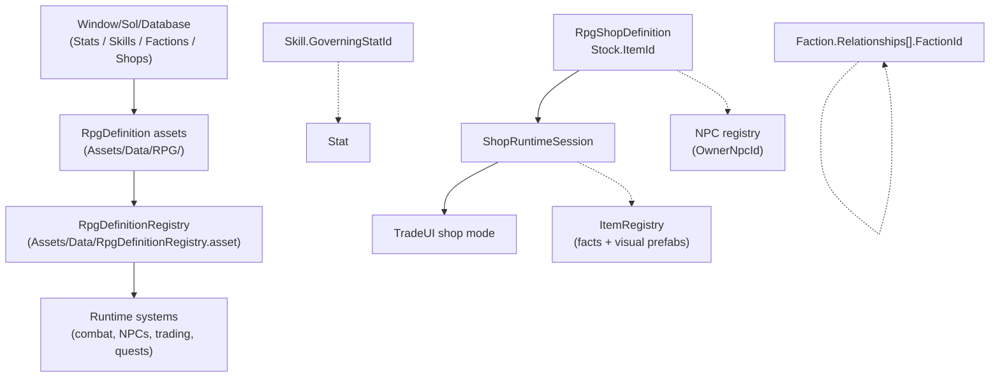

# RPG

*Stats, skills, factions, and shops as ScriptableObjects, plus the shop runtime layer that turns authored stock into tradeable inventory.*

## Purpose

The RPG system is the authored data spine for character progression, social standing, and economy. Stats, skills, factions, and shops are `ScriptableObject` definitions derived from [RpgDefinition](../../Assets/Scripts/RPG/RpgDefinition.cs), and a single [RpgDefinitionRegistry](../../Assets/Scripts/RPG/RpgDefinitionRegistry.cs) asset under [Assets/Data/](../../Assets/Data/) collects them for runtime lookup.

Shops connect RPG definitions to items and trading. `RpgShopDefinition` owns merchant stock authoring by item id. `ShopRuntimeSession` owns mutable shop state: current stock, current gold, prices, and restock timing. Item facts such as name, value, icon, tradeability, and equipment stats still come from [ItemRegistry](../../Assets/Scripts/Inventory/ItemOwnership/ItemRegistry.cs).

Authoring lives in the consolidated database window. See [Database Authoring](database-authoring.md).

## Key Files

- [RpgDefinition.cs](../../Assets/Scripts/RPG/RpgDefinition.cs): abstract base with `Id`, `DisplayName`, and `Description`.
- [RpgDefinitionIds.cs](../../Assets/Scripts/RPG/RpgDefinitionIds.cs): id prefix constants: `STA`, `SKL`, `FAC`, `SHP`.
- [RpgStatDefinition.cs](../../Assets/Scripts/RPG/RpgStatDefinition.cs): stat category, base/min/max value, and optional use-based improvement flag.
- [RpgSkillDefinition.cs](../../Assets/Scripts/RPG/RpgSkillDefinition.cs): skill category, optional governing stat id, max level, use-XP multiplier, and starts-known flag.
- [RpgFactionDefinition.cs](../../Assets/Scripts/RPG/RpgFactionDefinition.cs): faction flags and `RpgFactionRelationship` entries.
- [RpgShopDefinition.cs](../../Assets/Scripts/RPG/RpgShopDefinition.cs): authored shop seed data: owner, faction, gold, buy/sell multipliers, restock mode, and stock rows by item id.
- [ShopRuntimeSession.cs](../../Assets/Scripts/RPG/ShopRuntimeSession.cs): mutable runtime shop session seeded from a shop definition.
- [ShopRuntimeStore.cs](../../Assets/Scripts/RPG/ShopRuntimeStore.cs): active shop session cache, lookup, clear, and restore support.
- [RpgDefinitionRegistry.cs](../../Assets/Scripts/RPG/RpgDefinitionRegistry.cs): typed definition registry exposing `GetStat`, `GetSkill`, `GetFaction`, and `GetShop`.

## Id Scheme

| Type | Prefix | Asset menu |
|------|--------|------------|
| Stat | `STA#####` | `Sol/RPG/Stat Definition` |
| Skill | `SKL#####` | `Sol/RPG/Skill Definition` |
| Faction | `FAC#####` | `Sol/RPG/Faction Definition` |
| Shop | `SHP#####` | `Sol/RPG/Shop Definition` |

Cross-references are stored as string ids, not direct object references. Reference dropdowns in the database window write ids for stats, skills, factions, shops, items, NPCs, and quests.

## Entry Points

- **Authoring:** `Window/Sol/Database` -> `Stats`, `Skills`, `Factions`, or `Shops`.
- **Definition lookup:** `RpgDefinitionRegistry.Get()` then `GetStat`, `GetSkill`, `GetFaction`, or `GetShop`.
- **Shop runtime lookup:** `ShopRuntimeStore.GetOrCreateSession(shopId)` when a trader NPC or dialogue action opens merchant trading.
- **Direct asset creation:** Unity `Assets/Create/Sol/RPG/...`; the registry picks up new assets on editor sync.

## Shops And Trading

`RpgShopDefinition` is authored seed data:

- `OwnerNpcId`: optional NPC owner id.
- `FactionId`: optional faction id.
- `Gold`: starting shop gold.
- `BuyPriceMultiplier`: multiplier used when the player buys from the shop.
- `SellPriceMultiplier`: multiplier used when the player sells to the shop.
- `RestockMode`: `Never`, realtime hours, or in-game days.
- `Stock`: item id, min quantity, max quantity, and per-stock price multiplier.

`ShopRuntimeSession` is mutable runtime data:

- Session id is the shop id.
- Stock is seeded from `RpgShopDefinition.Stock`.
- Item facts and prices read registry values from `ItemRegistry`.
- Physical stock instances are instantiated from the registry visual/world prefab when inventory transfer needs an item object.
- Buying and selling mutate session stock and gold, not the authored shop definition.
- Restock restores authored stock quantities according to the shop definition.

Price rules:

- Buy price = registry item value x shop buy multiplier x stock entry price multiplier.
- Sell price = registry item value x shop sell multiplier.
- Prices clamp to non-negative integers.
- Nonzero-value buyable items cost at least 1g.

NPC inventories are not merchant stock. They remain valid for non-shop possessions, corpse loot, containers, quest delivery, and debug/free transfer.

## Data Flow

## Gotchas

- The registry asset lives at [Assets/Data/RpgDefinitionRegistry.asset](../../Assets/Data/RpgDefinitionRegistry.asset). The legacy `Resources` path is migrated on editor load.
- The registry registers itself in `PlayerSettings.GetPreloadedAssets()` so builds can resolve it without a `Resources` lookup.
- Editor sync is deferred. After a big content move, hit `Rebuild Registry` if lists look stale.
- `RpgStatDefinition.OnValidate` clamps `BaseValue` into `[Min, Max]`.
- `RpgShopStockEntry.MaxQuantity` is clamped up to `MinQuantity` on validate.
- Shop stock item ids must resolve in `ItemRegistry`; missing ids warn and do not seed runtime stock.
- Shop sessions persist separately from NPC inventory saves. Old saves without shop data seed shops from definitions on first open.
- Faction relationships are one-directional.
- All cross-references are strings. A `<Missing>` dropdown indicator means the registry cannot currently resolve the id.
