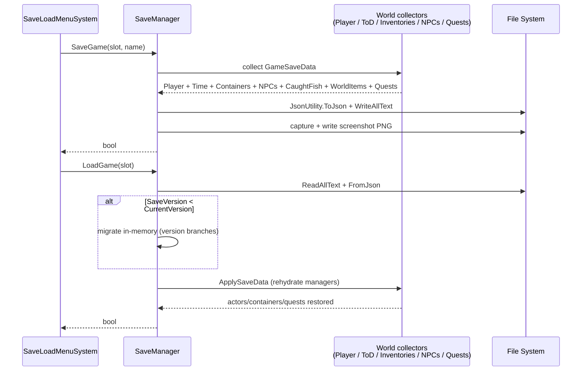

# Save System

*JSON on disk, versioned, with screenshots. Loses no fish.*

## Purpose

A slot-based save/load system. Captures the whole world state — player, time, containers, NPCs, caught fish, world items, quests — into a single JSON file per slot, with a PNG screenshot preview. Versioned so older saves can be migrated forward as the schema grows.

## Key files

- [SaveManager.cs](../../Assets/Scripts/Management/SaveManager.cs) — the singleton. Save, load, delete, enumerate slot metadata, load screenshot. Lives on a persistent GameObject (put it with [QuestManager](../../Assets/Scripts/Quests/QuestManager.cs)).
- [SaveData.cs](../../Assets/Scripts/Management/SaveData.cs) — all `[Serializable]` DTOs: `GameSaveData` (root), `SaveMetadata`, `PlayerSaveData`, `TimeSaveData`, `ContainerSaveData`, `NPCSaveData`, `CaughtFishData`, `WorldItemSaveData`, `QuestSaveData`.
- [UserInterface/SaveLoadMenuSystem.cs](../../Assets/Scripts/UserInterface/SaveLoadMenuSystem.cs) — the UI in front of it.

Related state owners that `SaveManager` calls into:
- [PlayerSoul](../../Assets/Scripts/Player/) (position, inventory, equipped items, gold, health)
- [TimeOfDay](../../Assets/Scripts/TimeOfDay/TimeofDay.cs) + [Calendar](../../Assets/Scripts/TimeOfDay/Calendar.cs)
- [Inventory](../../Assets/Scripts/Interactions/Inventory.cs) (for every world container)
- [AI_NPC](../../Assets/Scripts/NPCs/AI_NPC.cs) + [NPCSoul](../../Assets/Scripts/NPCs/NPCSoul.cs)
- [QuestManager](../../Assets/Scripts/Quests/QuestManager.cs)

## Slots and storage

- **Slot count:** `SaveManager.MaxSlots = 25`.
- **Autosave:** slot `0` (`AutoSaveSlot`).
- **Location:** `Application.persistentDataPath/saves/` — e.g. on Windows, `%USERPROFILE%\AppData\LocalLow\<Company>\<Product>\saves\`.
- **Format:** JSON via `JsonUtility.ToJson(data, prettyPrint: true)`. One file per slot; a sibling PNG for the screenshot preview.

## Save / load flow

## What persists

From [SaveData.cs](../../Assets/Scripts/Management/SaveData.cs) (`GameSaveData`, `CurrentVersion = 4`):

| Field | Covers |
|-------|--------|
| `Player` | Position, rotation, health/maxhealth, gold, inventory items, equipped items |
| `Time` | `CurrentTime` (0..1), calendar day/month/year, `TotalDaysElapsed` |
| `Containers` | Every world `Inventory` in `Container` mode — contents, lock state, owner |
| `NPCs` | Per `NPCSoul`: position, rotation, health, inventory, state, conversation-ready flags |
| `CaughtFish` | Player's catch log (for the fish encyclopedia) |
| `WorldItems` | Dropped/placed items in the world |
| `Quests` | `QuestSaveData` list — active, ready, completed, failed, progress counters |
| `Metadata` | Save name, wall-clock timestamp, in-game date, playtime, screenshot filename |

## Versioning

`GameSaveData.CurrentVersion` is the contract. Bump it when the schema changes in a way that breaks old files. Migration is done in-memory on load — branch on `data.SaveVersion` and backfill new fields with defaults.

Current version: `4` (quest runtime state was added in v4).

## Gotchas

- **`JsonUtility` can't serialize dictionaries.** All per-key maps in `GameSaveData` are lists of `[Serializable]` entries with explicit key fields. Don't introduce a `Dictionary<K,V>` into a saved type — it'll silently drop on write.
- **`JsonUtility` also skips properties, statics, and readonly fields.** Only public/`[SerializeField]` instance fields survive the round trip. If a save seems to "forget" something you added, check its visibility.
- **Screenshot and save are written separately.** If the screenshot write fails, the save is still valid but the UI preview will be missing. `DeleteSave` cleans both.
- **`FindFirstObjectByType<Calendar>()` is used inside `FormatInGameDate`** to resolve month names when displaying slot metadata. In a scene without a `Calendar` active, the UI falls back to `"Month N"`.
- **Loading is not additive.** `ApplySaveData` assumes the current scene contains the right NPCs/containers to rehydrate (matched by stable id). Loading into the wrong scene produces orphaned data.
- **Autosave slot `0` is implicitly trusted.** If you want a "do not overwrite" slot, it's not that one.
