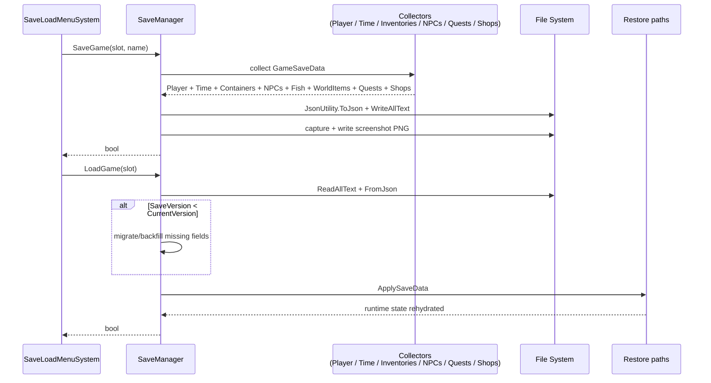

# Save System

*JSON on disk, versioned, with screenshots. Keeps fish, quests, world items, NPC inventories, and mutable shop state intact.*

## Purpose

A slot-based save/load system. It captures the world state into one JSON file per slot, plus a PNG screenshot preview. The schema is versioned so older saves can be migrated forward as systems grow.

Current save version: `10`.

Version 10 adds gameplay tag snapshots for runtime state. Player, NPC, item instance, world item, container, interaction point, and caught fish records can now preserve tags such as `State.Stolen`, `State.Locked`, `State.Lockpickable`, `State.Owned`, `State.Depleted`, `State.Reserved`, `Job.Trader`, and `Actor.Hostile`.

Version 9 changes how `Time.CurrentTime` is stored — it is now a normalized civil-day progress value measured **from midnight** (so 0.0 = 00:00, 0.5 = 12:00). Older saves are upgraded in `SaveManager.FormattingAndUpgrades` on load.

Version 8 added shop runtime state. Merchant stock no longer depends on NPC inventory save data; shops save their own mutable gold, stock, and restock timing.

## Key Files

- [SaveManager.cs](../../Assets/Scripts/Management/SaveManager.cs): singleton for save, load, delete, slot metadata, and screenshots.
- [SaveData.cs](../../Assets/Scripts/Management/SaveData.cs): all serializable DTOs, including `GameSaveData`, `ShopSaveData`, and item/inventory/world/NPC/quest data.
- [SaveManager.Capture.cs](../../Assets/Scripts/Management/SaveManager.Capture.cs): collects scene/runtime state into `GameSaveData`.
- [SaveManager.ApplyRestore.cs](../../Assets/Scripts/Management/SaveManager.ApplyRestore.cs): applies loaded data back into runtime systems.
- [SaveLoadMenuSystem.cs](../../Assets/Scripts/UserInterface/SaveLoadMenuSystem.cs): UI in front of save/load.

Related state owners:

- [PlayerSoul](../../Assets/Scripts/Player/): player position, health, stamina, inventory, equipment, and gold.
- [TimeOfDay](../../Assets/Scripts/TimeOfDay/TimeofDay.cs) + [Calendar](../../Assets/Scripts/TimeOfDay/Calendar.cs): clock and calendar.
- [Inventory](../../Assets/Scripts/Inventory/Inventory.cs): player/NPC inventory and world containers.
- [AI_NPC](../../Assets/Scripts/NPCs/AI_NPC.cs) + [NPCSoul](../../Assets/Scripts/NPCs/NPCSoul.cs): NPC position, health, state, and non-shop inventory.
- [QuestManager](../../Assets/Scripts/Quests/QuestManager.cs): quest runtime state.
- [ShopRuntimeStore](../../Assets/Scripts/RPG/ShopRuntimeStore.cs): active shop sessions.

## Slots And Storage

- Slot count: `SaveManager.MaxSlots = 25`.
- Autosave: slot `0` (`AutoSaveSlot`).
- Location: `Application.persistentDataPath/saves/`.
- Format: `JsonUtility.ToJson(data, prettyPrint: true)`.
- One JSON file per slot, with a sibling PNG for the screenshot preview.

## Save / Load Flow

## What Persists

From `GameSaveData`:

| Field | Covers |
|-------|--------|
| `Player` | Position, rotation, health/max health, gold, tag paths, inventory items, equipped items |
| `Time` | Current time, calendar day/month/year, total elapsed days |
| `Containers` | World containers: contents, lock/security tag paths, owner |
| `NPCs` | NPC position, rotation, health, role/state tag paths, conversation flags, and non-shop inventory |
| `CaughtFish` | Fish registry/catch-log data plus caught-fish tag paths |
| `WorldItems` | Dropped/placed world item instances plus item state tag paths |
| `InteractionPoints` | Runtime interaction point tag paths such as depleted/reserved/in-use state |
| `Quests` | Active, ready, completed, failed, and objective progress |
| `Shops` | Mutable shop runtime state: shop id, gold, stock item ids/quantities, restock timestamps |
| `Metadata` | Save name, wall-clock timestamp, in-game date, playtime, screenshot filename |

## Shop Save Data

`ShopSaveData` stores:

- `ShopId`
- `Gold`
- `Stock`: item ids and quantities from the current shop session inventory
- `LastRestockRealtime`
- `LastRestockInGameDay`

On load:

- Existing shop save data restores through `ShopRuntimeStore.RestoreSession`.
- Missing shop save data is valid for older saves. The first time a shop opens, `ShopRuntimeStore.GetOrCreateSession` seeds it from `RpgShopDefinition`.
- NPC inventory save data continues to apply to non-shop inventory, corpse loot, containers, and other direct inventory use cases.

The save currently persists stock by item id and quantity. It does not preserve custom per-instance state for unusual items sold into a shop unless that state is represented by the item id/registry definition.

## Versioning

`GameSaveData.CurrentVersion` is the schema contract. Bump it when the shape of saved data changes. Migration is done in memory on load by checking `data.SaveVersion` and backfilling missing fields with safe defaults.

Recent versions:

- `10`: runtime gameplay tag snapshots for player, NPCs, item instances, world items, containers, interaction points, and caught fish. Current legacy fields such as `IsStolen`, `IsLocked`, `CanTrade`, and `IsHostile` are translated into tags on load.
- `9`: `TimeSaveData.CurrentTime` is normalized civil-day progress from midnight (0..1). Older saves are converted on load.
- `8`: shop runtime state.
- `7` and earlier: existing player/time/container/NPC/fish/world item/quest state.

## Gotchas

- `JsonUtility` cannot serialize dictionaries. Use lists of serializable entries with explicit key fields.
- `JsonUtility` skips properties, statics, and readonly fields. Saved data must be public or `[SerializeField]` instance fields.
- Screenshot and save files are written separately. If screenshot write fails, the save remains valid.
- Loading is not additive. `ApplySaveData` assumes the current scene contains the right NPCs/containers to rehydrate.
- Autosave slot `0` is implicitly trusted.
- Shops are restored independently from NPC inventories. Do not try to recover merchant stock from NPC inventory data.
- NPC schedule position is still re-derived from the restored clock. `ApplyRestore` calls `SnapToCurrentScheduleTarget` on every NPC with a schedule definition. Interaction points now save runtime tag state, but active animation/session continuity is not restored; the point state is restored as data, not as a resumed coroutine/action.
