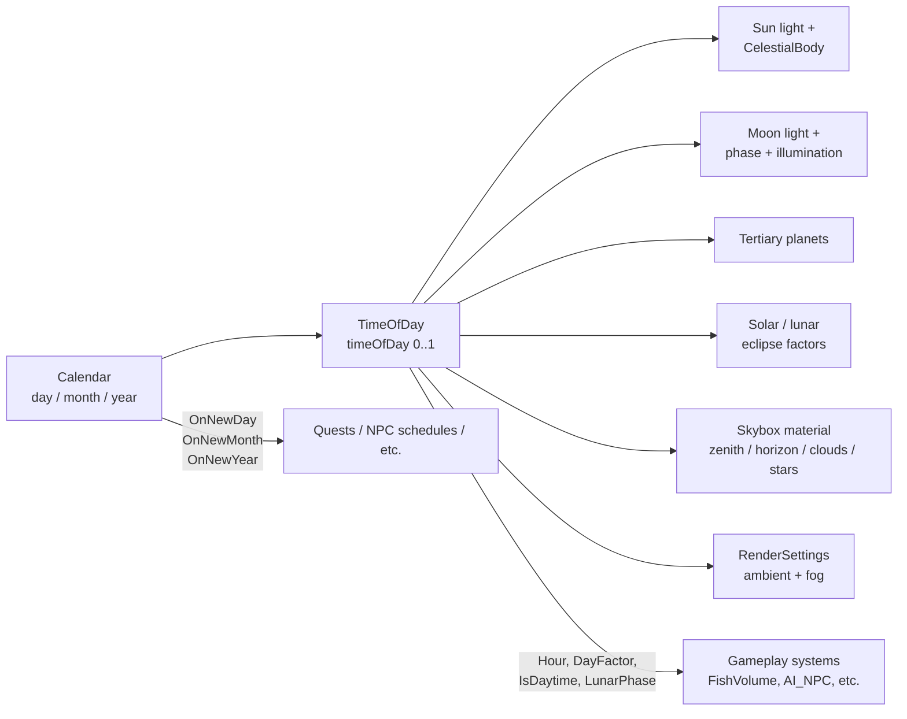
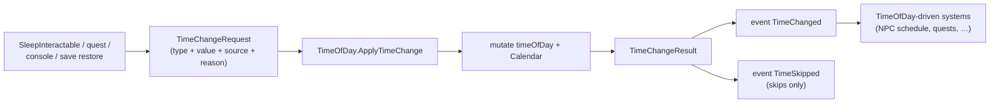

# Time of Day

*A clock with opinions. Drives the sky, the seasons, and — roughly once in a while — an eclipse.*

## Purpose

A single `TimeOfDay` component runs the full day/night cycle: the sun and moon positions, sun/moon lights, the ambient and fog state, a custom skybox shader's colors and cloud parameters, lunar phase, tertiary planets, and — because why not — genuine solar and lunar eclipses driven by lunar nodal precession. A sibling `Calendar` component tracks day/month/year with configurable month lengths and optional seasonal day-length variation.

Other systems read `DayFactor`, `Hour`, `IsDaytime`, and the calendar events to schedule their own behaviour.

## Key files

- [TimeofDay.cs](../../Assets/Scripts/TimeOfDay/TimeofDay.cs) — master clock. Drives everything.
- [Calendar.cs](../../Assets/Scripts/TimeOfDay/Calendar.cs) — date tracking, month names, seasons (`OnNewDay`, `OnNewMonth`, `OnNewYear` events), `AverageMonthLength` for lunar math.
- [ToD.CelestialBody.cs](../../Assets/Scripts/TimeOfDay/ToD.CelestialBody.cs) — per-body visual: the sun disc, moon disc, tertiary planets. Applies direction, eclipse factor, lit color.
- [ToD.CelestialBodyConfig.cs](../../Assets/Scripts/TimeOfDay/ToD.CelestialBodyConfig.cs) — `ScriptableObject` configs for each body.
- [ToD.TertiaryPlanetEntry.cs](../../Assets/Scripts/TimeOfDay/ToD.TertiaryPlanetEntry.cs) — a spawn entry for additional planets (prefab + config).
- [CelestialBodies/](../../Assets/Scripts/TimeOfDay/CelestialBodies/) — authored configs and prefabs.
- **Local README:** [TimeOfDay/README.md](../../Assets/Scripts/TimeOfDay/README.md). *(Note: its mention of `EnvironmentManager` / `WeatherManager` is stale — those are not in the current codebase; all of that functionality is now in `TimeOfDay` itself.)*

## Entry points

- One `TimeOfDay` component per scene, with a sibling `Calendar` on the same GameObject.
- Assign `sunPrefab` and `moonPrefab` — each must contain a `Light` (and optionally a `CelestialBody`).
- Optionally populate `tertiaryPlanets` for additional planets in the sky.
- Optional `CelestialBodyConfig` assets for sun and moon visual overrides.

## What time drives



The clock is authoritative: `Update` advances `timeOfDay` by `(timeScale * dt) / (cycleDurationMinutes * 60)`, rolls past 1.0 into calendar advancement, and everything else (sun angle, moon phase, sky material, eclipses) is derived per-frame from `timeOfDay` + `calendar.TotalDaysElapsed`.

## Eclipses

This is the unusual part and worth understanding. Eclipses aren't scripted — they emerge from the orbital math:

- Lunar phase rolls via `daysFraction / lunarPeriodDays` (period = average month length).
- Lunar tilt oscillates via a separate nodal precession period (`nodalPrecessionDays`, default 168 days).
- Solar eclipse only fires when: near new moon phase AND sun/moon angular distance < threshold AND sun is above the horizon.
- Lunar eclipse fires near full moon under mirrored rules.

That means you can genuinely predict eclipses from the authored parameters, and save/load doesn't break them because they're stateless given `timeOfDay + TotalDaysElapsed`.

## Editor preview

`[ExecuteAlways]` + an edit-mode `UpdateEditModePreview` path updates the skybox, ambient, and fog from `timeOfDay` without spawning prefabs. That means you can scrub `timeOfDay` in the inspector and watch the scene light up — no Play mode required.

## Calendar

Months, month names, and starting date are authored on [Calendar.cs](../../Assets/Scripts/TimeOfDay/Calendar.cs). The default project uses 12 months of 28 days with custom names (`Aurion`, `Solven`, `Thalmer`, …), starting at year 142. Seasons flip at the year boundary and at the year midpoint — `SeasonSign` returns ±1 which `TimeOfDay` uses to bias `dayRatio` when `enableSeasons` is on.

## Public API highlights

```csharp
float  DayFactor        // 0 = night, 1 = zenith
float  Hour / ClockHour // 0..24 (ClockHour is the schedule clock input)
bool   IsDaytime        // sun above horizon
float  LunarPhase       // 0..1
bool   IsEclipse        // solar or lunar

TimeChangeResult ApplyTimeChange(TimeChangeRequest request)
TimeChangeResult SetClockHour(float hour, Object source = null, string reason = null)
TimeChangeResult SetNormalizedTime(float t, Object source = null, string reason = null)
TimeChangeResult AdvanceHours(float h, Object source = null, string reason = null)
TimeChangeResult RewindHours(float h, Object source = null, string reason = null)

event Action<TimeChangeResult> TimeChanged   // every applied mutation
event Action<TimeChangeResult> TimeSkipped   // explicit jumps (sleep, skip-to-sunrise)
```

## TimeChangeRequest

Every gameplay-driven time mutation now goes through the `TimeChangeRequest` struct ([TimeChangeRequest.cs](../../Assets/Scripts/TimeOfDay/TimeChangeRequest.cs)). It encodes:

- `Type` — one of `AdvanceHours`, `RewindHours`, `SetClockHour`, `SetNormalizedTime`, `SetTimeScale`, `SetPaused`, `SkipToSunrise`, `SkipToSunset`, `SkipForwardOneDay`, `SkipBackwardOneDay`.
- `Value` — the scalar (hours, normalized t, scale, etc).
- `Source` — the `UnityEngine.Object` that initiated the change (e.g. the `SleepInteractable`).
- `Reason` — a short string for logs/replay/telemetry (defaults to the type name).

`ApplyTimeChange` returns a `TimeChangeResult` snapshot (`OldNormalizedTime`, `NewNormalizedTime`, `OldClockHour`, `NewClockHour`, `DaysDelta`, `Changed`) and fires the `TimeChanged` / `TimeSkipped` events. Consumers can react to one struct instead of re-reading clock state.

The convenience overloads (`AdvanceHours`, `SetClockHour`, …) are thin wrappers that build a request and call `ApplyTimeChange`. Beds and sleep flows use this path so a multiplayer host can later validate/replicate the same request shape without touching internal state.



Beds, skipping-to-dawn quests, and similar features use `AdvanceHours` / request-based skips rather than mutating `timeOfDay` directly so calendar advancement and event publication happen correctly.

### Sleep flow example

[SleepInteractable](../../Assets/Scripts/Interactables/SleepInteractable.cs) is the canonical caller. It wraps an `InteractionPoint` (the bed) and an [OpenSleepMenuAction](../../Assets/Scripts/ActionSystem/Actions/OpenSleepMenuAction.cs):

1. Player interacts → `OpenSleepMenuAction` reserves the bed's `InteractionPoint` and waits for its session to reach `Ready`.
2. The radial [SleepMenuSystem](../../Assets/Scripts/UserInterface/SleepMenuSystem.cs) opens, previewing hours and stamina/health recovery.
3. On confirm, `SleepInteractable` calls `timeOfDay.ApplyTimeChange(TimeChangeRequest.AdvanceHours(hours, this, "Player Sleep"))` so every listener (NPC schedules, weather, …) sees one coherent jump.
4. Recovery is applied, the screen fade lifts, and the `Get Up` prompt stays active until dismissed.

## Gotchas

- **`Calendar` is required.** `TimeOfDay` has `[RequireComponent(typeof(Calendar))]`. Don't split them across GameObjects.
- **Skybox material must be the custom Sol skybox.** All the `_ZenithColor`, `_HorizonColor`, `_CloudCoverage`, etc. properties are project-specific. Swap the skybox and the driver silently no-ops.
- **Edit-mode preview writes to `RenderSettings`.** If you scrub `timeOfDay` in the editor and Unity crashes, the scene can be left with night-time ambient + fog. Not data loss — just open `Window → Rendering → Lighting` and re-bake or toggle `controlAmbient`.
- **Eclipses are continuous, not scripted.** If you want to disable them (e.g. for a cinematic), set `eclipseThresholdDegrees` to zero or force `solarEclipseFactor = 0` downstream — there's no `enableEclipses` bool today.
- **The local [README](../../Assets/Scripts/TimeOfDay/README.md) is out of date** (mentions `EnvironmentManager` / `WeatherManager`). Treat this doc as the source of truth.
