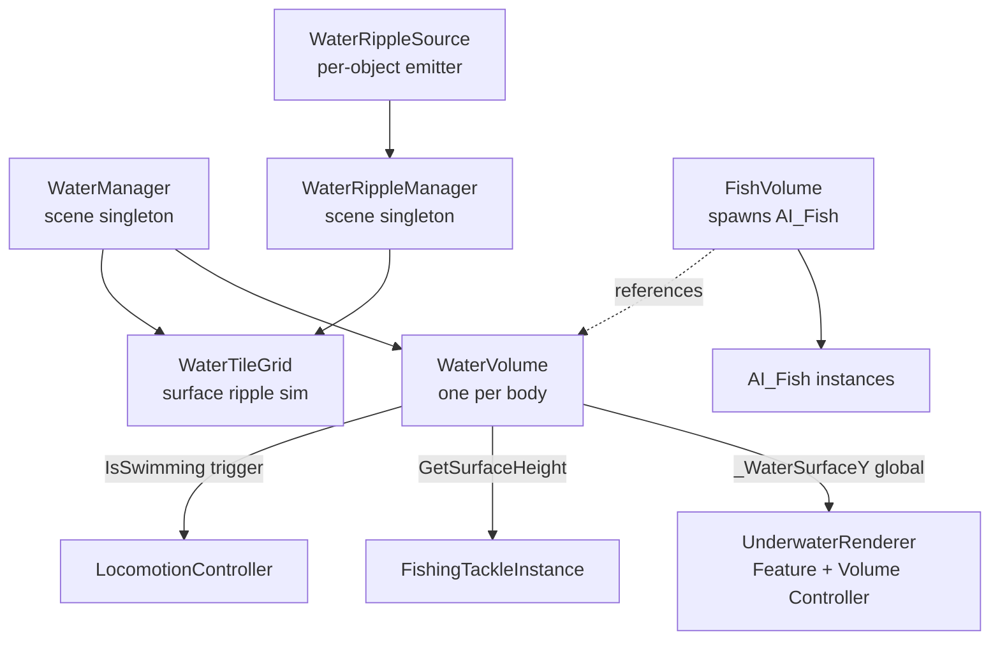

# Water

*The wet bit. Where fish live, where you swim, where the rod goes.*

## Purpose

Everything that makes water gameplay-meaningful: the `WaterVolume` trigger that toggles swimming and synchronizes wave math with the shader, the `FishVolume` that spawns AI fish, the tile-grid ripple system that reacts to cast splashes and walking, and the underwater renderer feature that overlays the camera while submerged.

The headline trick: `WaterVolume` replicates the shader's wave formula in C# so buoyancy and cast-target surface height stay in lock-step with the visual surface. No guessing.

## Key files

- [WaterVolume.cs](../../Assets/Scripts/Water/WaterVolume.cs) — trigger-collider water body. Syncs wave params from the assigned `waterMaterial`, sets `LocomotionController.IsSwimming`, exposes `GetSurfaceHeight(xz)`, pushes `_WaterSurfaceY` to the shader.
- [FishVolume.cs](../../Assets/Scripts/Water/FishVolume.cs) — spawn box for AI fish. Configurable species list (via `FishDefinition` + spawn chance), spawn count, padding rules to keep fish away from edges / surface / terrain. Optionally follows the player.
- [WaterTileGrid.cs](../../Assets/Scripts/Water/WaterTileGrid.cs) — tile grid for surface ripple simulation.
- [WaterRippleSource.cs](../../Assets/Scripts/Water/WaterRippleSource.cs) — per-object ripple emitter. Tackle splashes, footsteps on water, grabbed objects hitting the surface.
- [UnderwaterRendererFeature.cs](../../Assets/Scripts/Water/UnderwaterRendererFeature.cs) — URP Renderer Feature that blits an underwater overlay when the camera is below `_WaterSurfaceY`.
- [UnderwaterVolumeController.cs](../../Assets/Scripts/Water/UnderwaterVolumeController.cs) — controls post-process volume weights based on submersion depth.
- [Management/WaterManager.cs](../../Assets/Scripts/Management/WaterManager.cs) — global coordinator for water tiles / ripple sources.
- [Management/WaterRippleManager.cs](../../Assets/Scripts/Management/WaterRippleManager.cs) — scene-level ripple aggregator; feeds ripple data into shader-readable buffers.
- [Water/Editor/WaterTileGridEditor.cs](../../Assets/Scripts/Water/Editor/WaterTileGridEditor.cs) — authoring helper for tile grids.
- [Water/Shaders/](../../Assets/Scripts/Water/Shaders/) / [Water/Textures/](../../Assets/Scripts/Water/Textures/) — the actual water/underwater shaders and their textures.
- [Water/Util/](../../Assets/Scripts/Water/Util/) — shared helpers.

## Entry points

- **Per water body:** a `WaterVolume` with a `BoxCollider` sized so its top face sits at the flat water surface, plus the water mesh itself with the `Sol.Water` material.
- **If the body contains fish:** a `FishVolume` referencing that `WaterVolume` with an authored spawn list.
- **Scene-wide:**
  - [WaterManager](../../Assets/Scripts/Management/WaterManager.cs) — one instance.
  - [WaterRippleManager](../../Assets/Scripts/Management/WaterRippleManager.cs) — one instance.
  - The URP Renderer Feature `UnderwaterRendererFeature` registered on the active renderer.

## Water stack

## What runtime signals reach where

- **Swimming:** `WaterVolume.OnTriggerEnter` / `OnTriggerExit` on a `LocomotionController` sets `IsSwimming`. The controller then re-routes movement through its swim code path.
- **Cast surface:** `FishingState.BeginCast` calls `WaterVolume.FindVolumeXZ(castTarget)` to find which body the tackle is heading into; the tackle then uses `GetSurfaceHeight` to know where to rest. Casting outside any `WaterVolume` cancels the cast (via `ShouldCancelCast`).
- **Ripples:** Cast impact, grabbed objects hitting water, and footsteps on water all create a `WaterRippleSource` for one frame. The ripple manager aggregates them into a data buffer the water shader samples.
- **Underwater post:** When the camera's Y is below `_WaterSurfaceY`, the URP renderer feature blits the underwater overlay; `UnderwaterVolumeController` ramps Volume weights with depth.

## Authoring a new water body

1. Place an empty at the vertical centre of the water.
2. Add [WaterVolume.cs](../../Assets/Scripts/Water/WaterVolume.cs). A `BoxCollider` is auto-added and set to trigger.
3. Resize the box so the **top face** sits on the flat surface plane.
4. Assign the `Sol.Water` material used on the visible water mesh to `waterMaterial` — wave parameters read from it automatically.
5. Tune `swimDepthThreshold` if the default swim waterline feels wrong.

## Authoring a fish volume

1. Child a `FishVolume` to (or near) the `WaterVolume`.
2. Assign the `WaterVolume` in the inspector.
3. Populate `fishSpawnEntries` with `FishDefinition` + spawn chance.
4. Set `fishSpawnCount`. Tune padding (`edgePadding`, `surfacePadding`, `bottomPadding`, `terrainClearance`) to keep fish off geometry.
5. If the body is very large and fish should stay near the player, enable `followPlayer` and assign the player transform.

## Gotchas

- **The `BoxCollider`'s top face is the surface.** The C# wave solver adds waves on top of that plane; if your box isn't at the right height, every buoyancy and cast calculation in the game drifts by that offset.
- **Wave parameters sync from the material, not the volume.** If two bodies share a material, they share waves — swap the material reference or clone the material for a different look.
- **`_WaterSurfaceY` is a single global.** If you have overlapping water bodies at different heights, the underwater renderer can only know about one at a time (whichever `WaterVolume` updated it last). That's a real limitation — don't stack ponds vertically.
- **Fish in a non-`followPlayer` volume won't respawn across the map.** They stay inside the initial spawn box. Long bodies of water may need multiple `FishVolume`s rather than one huge one.
- **`[RequireComponent(typeof(BoxCollider))]` on both `WaterVolume` and `FishVolume`** is deliberate — sphere/capsule colliders would break the xz-query and padding logic.
